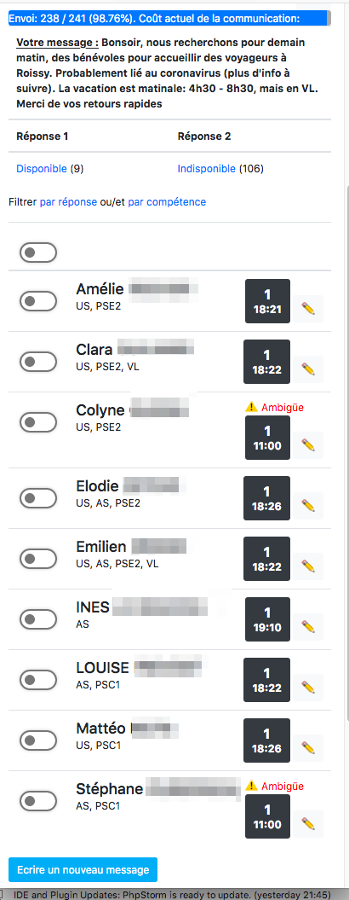

# FIC 2020

Bonjour cher Chasseur et bienvenue au FIC ! 

Je suis là pour te donner quelques informations contextuelles qui pourront 
probablement t'aider à mieux trouver les probables 🕷 qui se cachent dans
ces quelques 50 000 lignes de code.

## Contexte

La Croix-Rouge Française possède un peu plus d'un millier de structures
ayant des fonctions diverses, notament dans l'action sociale et le secourisme.

- Si par exemple un grave accident a lieu dans un immeuble et des dizaines
de personnes se retrouvent à la rue, l'Action Sociale va les prendre en
charge, les réchauffer/nourir si besoin, et trouver des solutions
d'urgence.

- Ou si par exemple une manifestation déborde et que le SAMU est trop 
solicité, ils peuvent faire appel à nous afin qu'on vienne leur donner 
un coup de main avec nos ambulances.

Mais voilà : on est tous des civiles et bénévoles et on habite un peu partout.
Pour réunir les effectifs dont une intervention a besoin, les responsbles
de chaque unité locale doivent efficacement faire appel à leurs volontaires.
 
C'est là que RedCall intervient : elle permet à ces responsables de
contacter les ressources dont ils ont besoin par SMS ou email.

> Bonsoir, nous recherchons pour demain matin, des bénévoles pour 
> accueillir des voyageurs à Roissy. Probablement lié au coronavirus 
> (plus d'info à suivre). La vacation est matinale: 4h30 - 8h30, mais
> en VL. Merci de vos retours rapides.
>
> 1. Disponible
> 2. Indisponible
>
> Pour répondre, saisir le n* de votre choix.  
 
Les réponses s'affichent directement sur un tableau de bord, rafraîchi en
live, ce qui permet de monter rapidement des équipages. 

## Granularité des droits

Sur RedCall, les utilisateurs sont tous des responsables de l'urgence,
mais leur périmètre n'est pas toujours le même.

1. Un responsable d'une unité locale (UL) peut déclencher seulement son UL.
Par exemple, Paris 1er ne peut déclencher que ses bénévoles.

2. Un responsable d'une direction territoriale (DT) peut déclencher toutes
les UL de son périmètre. Par exemple, la DT de Paris peut déclencher les
16 ULs de Paris.

3. Un bénévole peut-être desactivé pour plusieurs raisons (il ne fait plus
partie de la Croix-Rouge par exemple), et il ne doit jamais être déclenché.

Je pense qu'avec tout ça, on peut déjà s'amuser sur les "broken access 
control".

## Accès

|        Login        |                                               Permission                                               |
|---------------------|--------------------------------------------------------------------------------------------------------|
| nothing@example.com | Peut accéder a l'application mais n'est pas relié à un volontaire, du coup ne peut déclencher personne |
| onetwo@example.com  | Est relié à l'UL de Paris 1er/2nd arrondissement (une seule UL dans son périmètre)                     |
| lille@example.com   | Est relié à l'UL de Lille (qui possède des sous-structures)                                            |
| dtparis@example.com | Est relié à la DT de Paris (qui possède pleins d'ULs, mais pas Lille!)                                 |
| admin@example.com   | N'est pas relié à un volontaire du coup ne peut déclencher personne, mais peut administrer des trucs.  |

A noter: 
- password = login
- utilisez l'admin pour activer ou relier des volontaires à vos propres comptes

