# Site Map

This document provides a global overview of the application routes.

Generated on 17/01/2026

Objectives:

- remove dead code
- remove useless features
- improve UX where possible
- improve test coverage

## Route List

| URL                                                                                                                | Description                                 |
|--------------------------------------------------------------------------------------------------------------------|---------------------------------------------|
| `/`                                                                                                                | General                                     |
| `/_ah/start`                                                                                                       | General                                     |
| `/_ah/stop`                                                                                                        | General                                     |
| `/_ah/warmup`                                                                                                      | General                                     |
| `/admin/`                                                                                                          | [Admin]                                     |
| `/admin/answer-analysis`                                                                                           | [Admin] - List                              |
| `/admin/badges`                                                                                                    | [Admin] / Badges - List                     |
| `/admin/badges/change-platform/{csrf}/{id}/{platform}`                                                             | [Admin] / Badges - Edit                     |
| `/admin/badges/manage-{id}`                                                                                        | [Admin] / Badges                            |
| `/admin/badges/toggle-enable-{id}/{token}`                                                                         | [Admin] / Badges - Toggle State             |
| `/admin/badges/toggle-lock-{id}/{token}`                                                                           | [Admin] / Badges - Toggle State             |
| `/admin/badges/toggle-visibility-{id}/{token}`                                                                     | [Admin] / Badges - Toggle State             |
| `/admin/campaign`                                                                                                  | Campaigns / [Admin] - List                  |
| `/admin/categories/`                                                                                               | [Admin] - List                              |
| `/admin/categories/add-badge-in-category-{id}/{token}`                                                             | [Admin] / Badges - Create                   |
| `/admin/categories/change-platform/{csrf}/{id}/{platform}`                                                         | [Admin] - Edit                              |
| `/admin/categories/delete-badge-{badgeId}-in-category-{categoryId}/{token}`                                        | [Admin] / Badges - Delete                   |
| `/admin/categories/delete-category-{id}/{token}`                                                                   | [Admin] / Categories - Delete               |
| `/admin/categories/enable-disable-{id}/{token}`                                                                    | [Admin] - Toggle State                      |
| `/admin/categories/form-for-{id}`                                                                                  | [Admin]                                     |
| `/admin/categories/list-badges-in-category-{id}`                                                                   | [Admin] / Badges                            |
| `/admin/categories/lock-unlock-{id}/{token}`                                                                       | [Admin] - Toggle State                      |
| `/admin/categories/refresh-category-category-{id}`                                                                 | [Admin] / Categories                        |
| `/admin/gdpr`                                                                                                      | [Admin] - List                              |
| `/admin/maintenance/`                                                                                              | [Admin] - List                              |
| `/admin/maintenance/annuaire-national`                                                                             | [Admin]                                     |
| `/admin/maintenance/message`                                                                                       | [Admin]                                     |
| `/admin/maintenance/pegass-files`                                                                                  | [Admin] / Pegass (Personnel)                |
| `/admin/maintenance/refresh`                                                                                       | [Admin]                                     |
| `/admin/maintenance/search`                                                                                        | [Admin] - Search                            |
| `/admin/maintenance/search/change-expression`                                                                      | [Admin] - Search                            |
| `/admin/maintenance/search/change-nivol`                                                                           | [Admin] - Search                            |
| `/admin/pegass`                                                                                                    | [Admin] / Pegass (Personnel) - List         |
| `/admin/pegass/add-structure/{csrf}/{id}`                                                                          | [Admin] / Pegass (Personnel) - Create       |
| `/admin/pegass/administrators`                                                                                     | [Admin] / Pegass (Personnel)                |
| `/admin/pegass/create-user`                                                                                        | [Admin] / Pegass (Personnel) - Create       |
| `/admin/pegass/delete/{csrf}/{id}`                                                                                 | [Admin] / Pegass (Personnel) - Delete       |
| `/admin/pegass/list-users`                                                                                         | [Admin] / Pegass (Personnel) - List         |
| `/admin/pegass/revoke-admin/{csrf}/{id}`                                                                           | [Admin] / Pegass (Personnel)                |
| `/admin/pegass/rtmr`                                                                                               | [Admin] / Pegass (Personnel)                |
| `/admin/pegass/toggle-admin/{csrf}/{id}`                                                                           | [Admin] / Pegass (Personnel) - Toggle State |
| `/admin/pegass/toggle-developer/{csrf}/{id}`                                                                       | [Admin] / Pegass (Personnel) - Toggle State |
| `/admin/pegass/toggle-lock/{csrf}/{id}`                                                                            | [Admin] / Pegass (Personnel) - Toggle State |
| `/admin/pegass/toggle-pegass-api/{csrf}/{id}`                                                                      | [Admin] / Pegass (Personnel) - Toggle State |
| `/admin/pegass/toggle-root/{csrf}/{id}`                                                                            | [Admin] / Pegass (Personnel) - Toggle State |
| `/admin/pegass/toggle-trust/{csrf}/{id}`                                                                           | [Admin] / Pegass (Personnel) - Toggle State |
| `/admin/pegass/toggle-verify/{csrf}/{id}`                                                                          | [Admin] / Pegass (Personnel) - Toggle State |
| `/admin/pegass/update-structures/{id}`                                                                             | [Admin] / Pegass (Personnel) - Edit         |
| `/admin/pegass/update/{csrf}/{id}`                                                                                 | [Admin] / Pegass (Personnel) - Edit         |
| `/admin/platform/switch-me/{csrf}/{platform}`                                                                      | [Admin]                                     |
| `/admin/reponses-pre-remplies/`                                                                                    | [Admin] - List                              |
| `/admin/reponses-pre-remplies/editer/{pfaId}`                                                                      | [Admin] - Edit                              |
| `/admin/reponses-pre-remplies/supprimer/{csrf}/{pfaId}`                                                            | [Admin] - Delete                            |
| `/admin/stats/`                                                                                                    | Statistics / [Admin]                        |
| `/admin/stats/general`                                                                                             | Statistics / [Admin]                        |
| `/admin/stats/structure`                                                                                           | Statistics / [Admin]                        |
| `/admin/users/`                                                                                                    | [Admin] / User Account - Login              |
| `/admin/users/delete/{username}/{csrf}`                                                                            | [Admin] / User Account - Login              |
| `/admin/users/profile/{username}`                                                                                  | [Admin] / User Account - Login              |
| `/admin/users/reset-password/{username}/{csrf}`                                                                    | [Admin] / User Account - Login              |
| `/admin/users/toggle-admin/{username}/{csrf}`                                                                      | [Admin] / User Account - Login              |
| `/admin/users/toggle-trust/{username}/{csrf}`                                                                      | [Admin] / User Account - Login              |
| `/admin/users/toggle-verify/{username}/{csrf}`                                                                     | [Admin] / User Account - Login              |
| `/api/admin/badge`                                                                                                 | [API] / Badges                              |
| `/api/admin/badge`                                                                                                 | [API] / Badges - Create                     |
| `/api/admin/badge/{externalId}`                                                                                    | [API] / Badges - View                       |
| `/api/admin/badge/{externalId}`                                                                                    | [API] / Badges - Edit                       |
| `/api/admin/badge/{externalId}`                                                                                    | [API] / Badges - Delete                     |
| `/api/admin/badge/{externalId}/coverage`                                                                           | [API] / Badges                              |
| `/api/admin/badge/{externalId}/coverage`                                                                           | [API] / Badges - Create                     |
| `/api/admin/badge/{externalId}/coverage`                                                                           | [API] / Badges - Delete                     |
| `/api/admin/badge/{externalId}/disable`                                                                            | [API] / Badges                              |
| `/api/admin/badge/{externalId}/enable`                                                                             | [API] / Badges                              |
| `/api/admin/badge/{externalId}/lock`                                                                               | [API] / Badges                              |
| `/api/admin/badge/{externalId}/replacement`                                                                        | [API] / Badges                              |
| `/api/admin/badge/{externalId}/replacement`                                                                        | [API] / Badges - Create                     |
| `/api/admin/badge/{externalId}/replacement`                                                                        | [API] / Badges - Delete                     |
| `/api/admin/badge/{externalId}/unlock`                                                                             | [API] / Badges                              |
| `/api/admin/badge/{externalId}/volunteer`                                                                          | [API] / Volunteer Mgmt                      |
| `/api/admin/badge/{externalId}/volunteer`                                                                          | [API] / Volunteer Mgmt - Create             |
| `/api/admin/badge/{externalId}/volunteer`                                                                          | [API] / Volunteer Mgmt - Delete             |
| `/api/admin/category`                                                                                              | [API] / Categories                          |
| `/api/admin/category`                                                                                              | [API] / Categories - Create                 |
| `/api/admin/category/{categoryId}`                                                                                 | [API] / Categories - View                   |
| `/api/admin/category/{categoryId}`                                                                                 | [API] / Categories - Edit                   |
| `/api/admin/category/{categoryId}`                                                                                 | [API] / Categories - Delete                 |
| `/api/admin/category/{externalId}/badge`                                                                           | [API] / Badges                              |
| `/api/admin/category/{externalId}/badge`                                                                           | [API] / Badges - Create                     |
| `/api/admin/category/{externalId}/badge`                                                                           | [API] / Badges - Delete                     |
| `/api/admin/category/{externalId}/disable`                                                                         | [API] / Categories                          |
| `/api/admin/category/{externalId}/enable`                                                                          | [API] / Categories                          |
| `/api/admin/category/{externalId}/lock`                                                                            | [API] / Categories                          |
| `/api/admin/category/{externalId}/unlock`                                                                          | [API] / Categories                          |
| `/api/admin/platform/badge/{externalId}`                                                                           | [API] / Badges                              |
| `/api/admin/platform/category/{externalId}`                                                                        | [API] / Categories                          |
| `/api/admin/platform/structure/{externalId}`                                                                       | [API] / Structure Mgmt                      |
| `/api/admin/platform/user/{email}`                                                                                 | [API] / User Account                        |
| `/api/admin/platform/volunteer/{externalId}`                                                                       | [API] / Volunteer Mgmt                      |
| `/api/admin/user`                                                                                                  | [API] / User Account                        |
| `/api/admin/user`                                                                                                  | [API] / User Account - Create               |
| `/api/admin/user/{email}`                                                                                          | [API] / User Account - View                 |
| `/api/admin/user/{email}`                                                                                          | [API] / User Account - Edit                 |
| `/api/admin/user/{email}`                                                                                          | [API] / User Account - Delete               |
| `/api/admin/user/{email}/lock`                                                                                     | [API] / User Account                        |
| `/api/admin/user/{email}/structure`                                                                                | [API] / User Account                        |
| `/api/admin/user/{email}/structure`                                                                                | [API] / User Account - Create               |
| `/api/admin/user/{email}/structure`                                                                                | [API] / User Account - Delete               |
| `/api/admin/user/{email}/unlock`                                                                                   | [API] / User Account                        |
| `/api/admin/user{email}/password-recovery`                                                                         | [API] / User Account                        |
| `/api/demo`                                                                                                        | [API]                                       |
| `/api/demo`                                                                                                        | [API]                                       |
| `/api/structure`                                                                                                   | [API] / Structure Mgmt                      |
| `/api/structure`                                                                                                   | [API] / Structure Mgmt - Create             |
| `/api/structure/{externalId}`                                                                                      | [API] / Structure Mgmt - View               |
| `/api/structure/{externalId}`                                                                                      | [API] / Structure Mgmt - Edit               |
| `/api/structure/{externalId}`                                                                                      | [API] / Structure Mgmt - Delete             |
| `/api/structure/{externalId}/disable`                                                                              | [API] / Structure Mgmt                      |
| `/api/structure/{externalId}/enable`                                                                               | [API] / Structure Mgmt                      |
| `/api/structure/{externalId}/lock`                                                                                 | [API] / Structure Mgmt                      |
| `/api/structure/{externalId}/tree`                                                                                 | [API] / Structure Mgmt                      |
| `/api/structure/{externalId}/unlock`                                                                               | [API] / Structure Mgmt                      |
| `/api/structure/{externalId}/user`                                                                                 | [API] / User Account                        |
| `/api/structure/{externalId}/user`                                                                                 | [API] / User Account - Create               |
| `/api/structure/{externalId}/user`                                                                                 | [API] / User Account - Delete               |
| `/api/structure/{externalId}/volunteer`                                                                            | [API] / Structure Mgmt                      |
| `/api/structure/{externalId}/volunteer`                                                                            | [API] / Structure Mgmt - Create             |
| `/api/structure/{externalId}/volunteer`                                                                            | [API] / Structure Mgmt - Delete             |
| `/api/trigger/sms`                                                                                                 | [API]                                       |
| `/api/volunteer`                                                                                                   | [API] / Volunteer Mgmt                      |
| `/api/volunteer`                                                                                                   | [API] / Volunteer Mgmt - Create             |
| `/api/volunteer/{email}`                                                                                           | [API] / Volunteer Mgmt - View               |
| `/api/volunteer/{externalId}`                                                                                      | [API] / Volunteer Mgmt - View               |
| `/api/volunteer/{externalId}`                                                                                      | [API] / Volunteer Mgmt - Edit               |
| `/api/volunteer/{externalId}`                                                                                      | [API] / Volunteer Mgmt - Delete             |
| `/api/volunteer/{externalId}/anonymize`                                                                            | [API] / Volunteer Mgmt                      |
| `/api/volunteer/{externalId}/badge`                                                                                | [API] / Volunteer Mgmt                      |
| `/api/volunteer/{externalId}/badge`                                                                                | [API] / Volunteer Mgmt - Create             |
| `/api/volunteer/{externalId}/badge`                                                                                | [API] / Volunteer Mgmt - Delete             |
| `/api/volunteer/{externalId}/disable`                                                                              | [API] / Volunteer Mgmt                      |
| `/api/volunteer/{externalId}/enable`                                                                               | [API] / Volunteer Mgmt                      |
| `/api/volunteer/{externalId}/lock`                                                                                 | [API] / Volunteer Mgmt                      |
| `/api/volunteer/{externalId}/phone`                                                                                | [API] / Volunteer Mgmt                      |
| `/api/volunteer/{externalId}/phone`                                                                                | [API] / Volunteer Mgmt - Create             |
| `/api/volunteer/{externalId}/phone`                                                                                | [API] / Volunteer Mgmt - Edit               |
| `/api/volunteer/{externalId}/phone/{e164}`                                                                         | [API] / Volunteer Mgmt - Delete             |
| `/api/volunteer/{externalId}/structure`                                                                            | [API] / Structure Mgmt                      |
| `/api/volunteer/{externalId}/structure`                                                                            | [API] / Structure Mgmt - Create             |
| `/api/volunteer/{externalId}/structure`                                                                            | [API] / Structure Mgmt - Delete             |
| `/api/volunteer/{externalId}/unlock`                                                                               | [API] / Volunteer Mgmt                      |
| `/audience/home`                                                                                                   | Audience Selection                          |
| `/audience/numbers`                                                                                                | Audience Selection                          |
| `/audience/problems`                                                                                               | Audience Selection                          |
| `/audience/resolve`                                                                                                | Audience Selection                          |
| `/audience/search-badge`                                                                                           | Audience Selection - Search                 |
| `/audience/search-volunteer`                                                                                       | Audience Selection - Search                 |
| `/audience/selection`                                                                                              | Audience Selection                          |
| `/auth`                                                                                                            | General                                     |
| `/campaign/answer/{csrf}/{id}`                                                                                     | Campaigns                                   |
| `/campaign/answers`                                                                                                | Campaigns                                   |
| `/campaign/goto/{id}`                                                                                              | Campaigns                                   |
| `/campaign/list`                                                                                                   | Campaigns - List                            |
| `/campaign/new/{type}`                                                                                             | Campaigns - Create                          |
| `/campaign/operations`                                                                                             | Campaigns - Search                          |
| `/campaign/play`                                                                                                   | Campaigns                                   |
| `/campaign/preview/{type}`                                                                                         | Campaigns - View                            |
| `/campaign/{campaignId}/provider-information/{messageId}`                                                          | Campaigns                                   |
| `/campaign/{campaignId}/rename-communication/{communicationId}`                                                    | Campaigns                                   |
| `/campaign/{campaign}/communication/{communication}/relaunch`                                                      | Campaigns                                   |
| `/campaign/{id}`                                                                                                   | Campaigns - List                            |
| `/campaign/{id}/add-communication/{type}`                                                                          | Campaigns - Create                          |
| `/campaign/{id}/audience`                                                                                          | Campaigns                                   |
| `/campaign/{id}/change-color/{color}/{csrf}`                                                                       | Campaigns                                   |
| `/campaign/{id}/close/{csrf}`                                                                                      | Campaigns                                   |
| `/campaign/{id}/group/rename/{index}`                                                                              | Campaigns                                   |
| `/campaign/{id}/group/volunteer/{volunteerId}/toggle/{index}`                                                      | Campaigns - Toggle State                    |
| `/campaign/{id}/keep/{csrf}`                                                                                       | Campaigns                                   |
| `/campaign/{id}/long-polling`                                                                                      | Campaigns                                   |
| `/campaign/{id}/new-communication/{type}/{key}`                                                                    | Campaigns - Create                          |
| `/campaign/{id}/notes`                                                                                             | Campaigns                                   |
| `/campaign/{id}/open/{csrf}`                                                                                       | Campaigns                                   |
| `/campaign/{id}/rename`                                                                                            | Campaigns                                   |
| `/campaign/{id}/report`                                                                                            | Campaigns                                   |
| `/campaign/{id}/short-polling`                                                                                     | Campaigns                                   |
| `/change-password/{uuid}`                                                                                          | General - Login                             |
| `/chart`                                                                                                           | General                                     |
| `/chart/query`                                                                                                     | General                                     |
| `/chart/query/edit/{id}`                                                                                           | General - Edit                              |
| `/cloud-task`                                                                                                      | General                                     |
| `/code/{identifier}`                                                                                               | General                                     |
| `/connect/{nivol}`                                                                                                 | General - Login                             |
| `/costs/`                                                                                                          | General                                     |
| `/cron/{key}`                                                                                                      | Cron Job                                    |
| `/deploy`                                                                                                          | General                                     |
| `/developer/`                                                                                                      | General                                     |
| `/developer/token/`                                                                                                | General - List                              |
| `/developer/token/console/{token}/sign`                                                                            | General                                     |
| `/developer/token/documentation/endpoint/{token}/{categoryId}/{endpointId}`                                        | Categories                                  |
| `/developer/token/documentation/home/{token}`                                                                      | General                                     |
| `/developer/token/export`                                                                                          | General - Export                            |
| `/developer/token/remove/{csrf}/{token}`                                                                           | General - Delete                            |
| `/developer/token/show-secret/{token}`                                                                             | General - View                              |
| `/export/{id}/csv`                                                                                                 | General - Export                            |
| `/export/{id}/pdf`                                                                                                 | General - Export                            |
| `/favorite-badge`                                                                                                  | Badges - List                               |
| `/favorite-badge/delete/{csrf}/{id}`                                                                               | Badges - Delete                             |
| `/forgot-password`                                                                                                 | General - Login                             |
| `/go-to-space`                                                                                                     | General                                     |
| `/google-connect`                                                                                                  | Google Hook - Login                         |
| `/google-verify`                                                                                                   | Google Hook                                 |
| `/guest`                                                                                                           | General - Login                             |
| `/locale/{locale}`                                                                                                 | General                                     |
| `/logout`                                                                                                          | General - Login                             |
| `/management/`                                                                                                     | General                                     |
| `/management/structures/change-platform/{csrf}/{id}/{platform}`                                                    | Structure Mgmt - Edit                       |
| `/management/structures/create/{id}`                                                                               | Structure Mgmt - Create                     |
| `/management/structures/export/{id}`                                                                               | Structure Mgmt - Export                     |
| `/management/structures/list-users`                                                                                | User Account - List                         |
| `/management/structures/pegass/{id}`                                                                               | Pegass (Personnel)                          |
| `/management/structures/toggle-enable-{id}/{token}`                                                                | Structure Mgmt - Toggle State               |
| `/management/structures/toggle-lock-{id}/{token}`                                                                  | Structure Mgmt - Toggle State               |
| `/management/structures/volunteer-lists/`                                                                          | Structure Mgmt - List                       |
| `/management/structures/volunteer-lists/{structureId}/`                                                            | Structure Mgmt - List                       |
| `/management/structures/volunteer-lists/{structureId}/cards/{volunteerListId}`                                     | Structure Mgmt - List                       |
| `/management/structures/volunteer-lists/{structureId}/create/{volunteerListId}`                                    | Structure Mgmt - List                       |
| `/management/structures/volunteer-lists/{structureId}/remove-one-volunteer/{csrf}/{volunteerListId}/{volunteerId}` | Structure Mgmt - List                       |
| `/management/structures/volunteer-lists/{structureId}/remove/{csrf}/{volunteerListId}`                             | Structure Mgmt - List                       |
| `/management/structures/{enabled}`                                                                                 | Structure Mgmt - List                       |
| `/management/structures/{structure}/prefilled-answers/`                                                            | Structure Mgmt - List                       |
| `/management/structures/{structure}/prefilled-answers/new`                                                         | Structure Mgmt - Create                     |
| `/management/structures/{structure}/prefilled-answers/{prefilledAnswers}/delete`                                   | Structure Mgmt - Delete                     |
| `/management/structures/{structure}/prefilled-answers/{prefilledAnswers}/editor`                                   | Structure Mgmt - Edit                       |
| `/management/structures/{structure}/template`                                                                      | Structure Mgmt - List                       |
| `/management/structures/{structure}/template/new`                                                                  | Structure Mgmt - Create                     |
| `/management/structures/{structure}/template/{template}/edit`                                                      | Structure Mgmt - Edit                       |
| `/management/structures/{structure}/template/{template}/{csrf}/delete`                                             | Structure Mgmt - Delete                     |
| `/management/structures/{structure}/template/{template}/{csrf}/move/{newPriority}`                                 | Structure Mgmt                              |
| `/management/volunteers/add-structure/{csrf}/{id}`                                                                 | Structure Mgmt - Create                     |
| `/management/volunteers/change-platform/{csrf}/{id}/{platform}`                                                    | Volunteer Mgmt - Edit                       |
| `/management/volunteers/create`                                                                                    | Volunteer Mgmt - Create                     |
| `/management/volunteers/delete-structure/{csrf}/{volunteerId}/{structureId}`                                       | Structure Mgmt - Delete                     |
| `/management/volunteers/delete/{volunteerId}/{answerId}`                                                           | Volunteer Mgmt - Delete                     |
| `/management/volunteers/edit-structures/{id}`                                                                      | Structure Mgmt - Edit                       |
| `/management/volunteers/list-user-structures`                                                                      | User Account - List                         |
| `/management/volunteers/manual-update/{id}`                                                                        | Volunteer Mgmt - Edit                       |
| `/management/volunteers/pegass-reset/{csrf}/{id}`                                                                  | Pegass (Personnel)                          |
| `/management/volunteers/pegass/{id}`                                                                               | Pegass (Personnel)                          |
| `/management/volunteers/remove-all-structures/{csrf}/{id}`                                                         | Structure Mgmt - Delete                     |
| `/management/volunteers/toggle-enable-{id}/{token}`                                                                | Volunteer Mgmt - Toggle State               |
| `/management/volunteers/toggle-lock-{id}/{token}`                                                                  | Volunteer Mgmt - Toggle State               |
| `/management/volunteers/{id}`                                                                                      | Volunteer Mgmt - List                       |
| `/msg//optout/{code}`                                                                                              | General                                     |
| `/msg/{code}`                                                                                                      | General                                     |
| `/msg/{code}/annuler/{signature}/{action}`                                                                         | General                                     |
| `/msg/{code}/{signature}/{action}`                                                                                 | General                                     |
| `/nivol`                                                                                                           | General                                     |
| `/profile`                                                                                                         | User Account - Login                        |
| `/register`                                                                                                        | General - Login                             |
| `/sandbox/`                                                                                                        | Dev Sandbox                                 |
| `/sandbox/anonymize/{csrf}`                                                                                        | Dev Sandbox                                 |
| `/sandbox/fake-call/`                                                                                              | Dev Sandbox - List                          |
| `/sandbox/fake-call/clear/{csrf}`                                                                                  | Dev Sandbox                                 |
| `/sandbox/fake-call/read/{e164}/{campaignId}`                                                                      | Campaigns - View                            |
| `/sandbox/fake-email/`                                                                                             | Dev Sandbox - List                          |
| `/sandbox/fake-email/clear/{csrf}`                                                                                 | Dev Sandbox                                 |
| `/sandbox/fake-email/read/{email}/{campaignId}`                                                                    | Campaigns - View                            |
| `/sandbox/fake-minutis/clear/{token}`                                                                              | Minutis (Ops)                               |
| `/sandbox/fake-minutis/{id}`                                                                                       | Minutis (Ops) - List                        |
| `/sandbox/fake-sms/`                                                                                               | Dev Sandbox - List                          |
| `/sandbox/fake-sms/clear/{csrf}`                                                                                   | Dev Sandbox                                 |
| `/sandbox/fake-sms/poll/{phoneNumber}`                                                                             | Dev Sandbox                                 |
| `/sandbox/fake-sms/send/{e164}/{csrf}`                                                                             | Dev Sandbox                                 |
| `/sandbox/fake-sms/thread/{e164}/{campaignId}`                                                                     | Campaigns - View                            |
| `/sandbox/fake-storage/{filename}`                                                                                 | Dev Sandbox                                 |
| `/sandbox/fixtures/`                                                                                               | Dev Sandbox - List                          |
| `/sandbox/spinner`                                                                                                 | Dev Sandbox                                 |
| `/space/{sessionId}/`                                                                                              | General                                     |
| `/space/{sessionId}/consult-data`                                                                                  | General                                     |
| `/space/{sessionId}/delete-data`                                                                                   | General - Delete                            |
| `/space/{sessionId}/download-data`                                                                                 | General                                     |
| `/space/{sessionId}/email`                                                                                         | General                                     |
| `/space/{sessionId}/enabled`                                                                                       | General                                     |
| `/space/{sessionId}/infos`                                                                                         | General                                     |
| `/space/{sessionId}/logout`                                                                                        | General - Logout                            |
| `/space/{sessionId}/phone`                                                                                         | General                                     |
| `/syn/{code}`                                                                                                      | General - List                              |
| `/syn/{code}/poll`                                                                                                 | General                                     |
| `/task/webhook`                                                                                                    | General                                     |
| `/twilio/answering-machine/{uuid}`                                                                                 | Twilio Hook                                 |
| `/twilio/incoming-call`                                                                                            | Twilio Hook                                 |
| `/twilio/incoming-message`                                                                                         | Twilio Hook                                 |
| `/twilio/message-status/{uuid}`                                                                                    | Statistics                                  |
| `/twilio/outgoing-call/{uuid}`                                                                                     | Twilio Hook                                 |
| `/verify-email/{uuid}`                                                                                             | General - Login                             |
| `/widget/badge-search`                                                                                             | Badges - Search                             |
| `/widget/category-search`                                                                                          | Categories - Search                         |
| `/widget/structure-search/{searchAll}`                                                                             | Structure Mgmt - Search                     |
| `/widget/template-data`                                                                                            | Public Widget                               |
| `/widget/volunteer-search/{searchAll}`                                                                             | Volunteer Mgmt - Search                     |

## Structure Visualization

```mermaid
graph LR
    ROOT[Home /]
ROOT --> ROOT_ah(/_ah)
ROOT_ah --> ROOT_ah_start(/start)
ROOT_ah --> ROOT_ah_stop(/stop)
ROOT_ah --> ROOT_ah_warmup(/warmup)
ROOT --> ROOT_admin(/admin)
ROOT_admin --> ROOT_admin_answeranalysis(/answer-analysis)
ROOT_admin --> ROOT_admin_badges(/badges)
ROOT_admin_badges --> ROOT_admin_badges_changeplatform(/change-platform)
ROOT_admin_badges --> ROOT_admin_badges_manageparam(/manage-:param)
ROOT_admin_badges --> ROOT_admin_badges_toggleenableparam(/toggle-enable-:param)
ROOT_admin_badges --> ROOT_admin_badges_togglelockparam(/toggle-lock-:param)
ROOT_admin_badges --> ROOT_admin_badges_togglevisibilityparam(/toggle-visibility-:param)
ROOT_admin --> ROOT_admin_campaign(/campaign)
ROOT_admin --> ROOT_admin_categories(/categories)
ROOT_admin_categories --> ROOT_admin_categories_addbadgeincategoryparam(/add-badge-in-category-:param)
ROOT_admin_categories --> ROOT_admin_categories_changeplatform(/change-platform)
ROOT_admin_categories --> ROOT_admin_categories_deletebadgeparamincategoryparam(/delete-badge-:param-in-category-:param)
ROOT_admin_categories --> ROOT_admin_categories_deletecategoryparam(/delete-category-:param)
ROOT_admin_categories --> ROOT_admin_categories_enabledisableparam(/enable-disable-:param)
ROOT_admin_categories --> ROOT_admin_categories_formforparam(/form-for-:param)
ROOT_admin_categories --> ROOT_admin_categories_listbadgesincategoryparam(/list-badges-in-category-:param)
ROOT_admin_categories --> ROOT_admin_categories_lockunlockparam(/lock-unlock-:param)
ROOT_admin_categories --> ROOT_admin_categories_refreshcategorycategoryparam(/refresh-category-category-:param)
ROOT_admin --> ROOT_admin_gdpr(/gdpr)
ROOT_admin --> ROOT_admin_maintenance(/maintenance)
ROOT_admin_maintenance --> ROOT_admin_maintenance_annuairenational(/annuaire-national)
ROOT_admin_maintenance --> ROOT_admin_maintenance_message(/message)
ROOT_admin_maintenance --> ROOT_admin_maintenance_pegassfiles(/pegass-files)
ROOT_admin_maintenance --> ROOT_admin_maintenance_refresh(/refresh)
ROOT_admin_maintenance --> ROOT_admin_maintenance_search(/search)
ROOT_admin --> ROOT_admin_pegass(/pegass)
ROOT_admin_pegass --> ROOT_admin_pegass_addstructure(/add-structure)
ROOT_admin_pegass --> ROOT_admin_pegass_administrators(/administrators)
ROOT_admin_pegass --> ROOT_admin_pegass_createuser(/create-user)
ROOT_admin_pegass --> ROOT_admin_pegass_delete(/delete)
ROOT_admin_pegass --> ROOT_admin_pegass_listusers(/list-users)
ROOT_admin_pegass --> ROOT_admin_pegass_revokeadmin(/revoke-admin)
ROOT_admin_pegass --> ROOT_admin_pegass_rtmr(/rtmr)
ROOT_admin_pegass --> ROOT_admin_pegass_toggleadmin(/toggle-admin)
ROOT_admin_pegass --> ROOT_admin_pegass_toggledeveloper(/toggle-developer)
ROOT_admin_pegass --> ROOT_admin_pegass_togglelock(/toggle-lock)
ROOT_admin_pegass --> ROOT_admin_pegass_togglepegassapi(/toggle-pegass-api)
ROOT_admin_pegass --> ROOT_admin_pegass_toggleroot(/toggle-root)
ROOT_admin_pegass --> ROOT_admin_pegass_toggletrust(/toggle-trust)
ROOT_admin_pegass --> ROOT_admin_pegass_toggleverify(/toggle-verify)
ROOT_admin_pegass --> ROOT_admin_pegass_updatestructures(/update-structures)
ROOT_admin_pegass --> ROOT_admin_pegass_update(/update)
ROOT_admin --> ROOT_admin_platform(/platform)
ROOT_admin_platform --> ROOT_admin_platform_switchme(/switch-me)
ROOT_admin --> ROOT_admin_reponsespreremplies(/reponses-pre-remplies)
ROOT_admin_reponsespreremplies --> ROOT_admin_reponsespreremplies_editer(/editer)
ROOT_admin_reponsespreremplies --> ROOT_admin_reponsespreremplies_supprimer(/supprimer)
ROOT_admin --> ROOT_admin_stats(/stats)
ROOT_admin_stats --> ROOT_admin_stats_general(/general)
ROOT_admin_stats --> ROOT_admin_stats_structure(/structure)
ROOT_admin --> ROOT_admin_users(/users)
ROOT_admin_users --> ROOT_admin_users_delete(/delete)
ROOT_admin_users --> ROOT_admin_users_profile(/profile)
ROOT_admin_users --> ROOT_admin_users_resetpassword(/reset-password)
ROOT_admin_users --> ROOT_admin_users_toggleadmin(/toggle-admin)
ROOT_admin_users --> ROOT_admin_users_toggletrust(/toggle-trust)
ROOT_admin_users --> ROOT_admin_users_toggleverify(/toggle-verify)
ROOT --> ROOT_api(/api)
ROOT_api --> ROOT_api_admin(/admin)
ROOT_api_admin --> ROOT_api_admin_badge(/badge)
ROOT_api_admin --> ROOT_api_admin_category(/category)
ROOT_api_admin --> ROOT_api_admin_platform(/platform)
ROOT_api_admin --> ROOT_api_admin_user(/user)
ROOT_api_admin --> ROOT_api_admin_userparam(/user:param)
ROOT_api --> ROOT_api_demo(/demo)
ROOT_api --> ROOT_api_structure(/structure)
ROOT_api_structure --> ROOT_api_structure_param(/:param)
ROOT_api --> ROOT_api_trigger(/trigger)
ROOT_api_trigger --> ROOT_api_trigger_sms(/sms)
ROOT_api --> ROOT_api_volunteer(/volunteer)
ROOT_api_volunteer --> ROOT_api_volunteer_param(/:param)
ROOT --> ROOT_audience(/audience)
ROOT_audience --> ROOT_audience_home(/home)
ROOT_audience --> ROOT_audience_numbers(/numbers)
ROOT_audience --> ROOT_audience_problems(/problems)
ROOT_audience --> ROOT_audience_resolve(/resolve)
ROOT_audience --> ROOT_audience_searchbadge(/search-badge)
ROOT_audience --> ROOT_audience_searchvolunteer(/search-volunteer)
ROOT_audience --> ROOT_audience_selection(/selection)
ROOT --> ROOT_auth(/auth)
ROOT --> ROOT_campaign(/campaign)
ROOT_campaign --> ROOT_campaign_answer(/answer)
ROOT_campaign_answer --> ROOT_campaign_answer_param(/:param)
ROOT_campaign --> ROOT_campaign_answers(/answers)
ROOT_campaign --> ROOT_campaign_goto(/goto)
ROOT_campaign_goto --> ROOT_campaign_goto_param(/:param)
ROOT_campaign --> ROOT_campaign_list(/list)
ROOT_campaign --> ROOT_campaign_new(/new)
ROOT_campaign_new --> ROOT_campaign_new_param(/:param)
ROOT_campaign --> ROOT_campaign_operations(/operations)
ROOT_campaign --> ROOT_campaign_play(/play)
ROOT_campaign --> ROOT_campaign_preview(/preview)
ROOT_campaign_preview --> ROOT_campaign_preview_param(/:param)
ROOT_campaign --> ROOT_campaign_param(/:param)
ROOT_campaign_param --> ROOT_campaign_param_providerinformation(/provider-information)
ROOT_campaign_param --> ROOT_campaign_param_renamecommunication(/rename-communication)
ROOT_campaign_param --> ROOT_campaign_param_communication(/communication)
ROOT_campaign_param --> ROOT_campaign_param_addcommunication(/add-communication)
ROOT_campaign_param --> ROOT_campaign_param_audience(/audience)
ROOT_campaign_param --> ROOT_campaign_param_changecolor(/change-color)
ROOT_campaign_param --> ROOT_campaign_param_close(/close)
ROOT_campaign_param --> ROOT_campaign_param_group(/group)
ROOT_campaign_param --> ROOT_campaign_param_keep(/keep)
ROOT_campaign_param --> ROOT_campaign_param_longpolling(/long-polling)
ROOT_campaign_param --> ROOT_campaign_param_newcommunication(/new-communication)
ROOT_campaign_param --> ROOT_campaign_param_notes(/notes)
ROOT_campaign_param --> ROOT_campaign_param_open(/open)
ROOT_campaign_param --> ROOT_campaign_param_rename(/rename)
ROOT_campaign_param --> ROOT_campaign_param_report(/report)
ROOT_campaign_param --> ROOT_campaign_param_shortpolling(/short-polling)
ROOT --> ROOT_changepassword(/change-password)
ROOT_changepassword --> ROOT_changepassword_param(/:param)
ROOT --> ROOT_chart(/chart)
ROOT_chart --> ROOT_chart_query(/query)
ROOT_chart_query --> ROOT_chart_query_edit(/edit)
ROOT --> ROOT_cloudtask(/cloud-task)
ROOT --> ROOT_code(/code)
ROOT_code --> ROOT_code_param(/:param)
ROOT --> ROOT_connect(/connect)
ROOT_connect --> ROOT_connect_param(/:param)
ROOT --> ROOT_costs(/costs)
ROOT --> ROOT_cron(/cron)
ROOT_cron --> ROOT_cron_param(/:param)
ROOT --> ROOT_deploy(/deploy)
ROOT --> ROOT_developer(/developer)
ROOT_developer --> ROOT_developer_token(/token)
ROOT_developer_token --> ROOT_developer_token_console(/console)
ROOT_developer_token --> ROOT_developer_token_documentation(/documentation)
ROOT_developer_token --> ROOT_developer_token_export(/export)
ROOT_developer_token --> ROOT_developer_token_remove(/remove)
ROOT_developer_token --> ROOT_developer_token_showsecret(/show-secret)
ROOT --> ROOT_export(/export)
ROOT_export --> ROOT_export_param(/:param)
ROOT_export_param --> ROOT_export_param_csv(/csv)
ROOT_export_param --> ROOT_export_param_pdf(/pdf)
ROOT --> ROOT_favoritebadge(/favorite-badge)
ROOT_favoritebadge --> ROOT_favoritebadge_delete(/delete)
ROOT_favoritebadge_delete --> ROOT_favoritebadge_delete_param(/:param)
ROOT --> ROOT_forgotpassword(/forgot-password)
ROOT --> ROOT_gotospace(/go-to-space)
ROOT --> ROOT_googleconnect(/google-connect)
ROOT --> ROOT_googleverify(/google-verify)
ROOT --> ROOT_guest(/guest)
ROOT --> ROOT_locale(/locale)
ROOT_locale --> ROOT_locale_param(/:param)
ROOT --> ROOT_logout(/logout)
ROOT --> ROOT_management(/management)
ROOT_management --> ROOT_management_structures(/structures)
ROOT_management_structures --> ROOT_management_structures_changeplatform(/change-platform)
ROOT_management_structures --> ROOT_management_structures_create(/create)
ROOT_management_structures --> ROOT_management_structures_export(/export)
ROOT_management_structures --> ROOT_management_structures_listusers(/list-users)
ROOT_management_structures --> ROOT_management_structures_pegass(/pegass)
ROOT_management_structures --> ROOT_management_structures_toggleenableparam(/toggle-enable-:param)
ROOT_management_structures --> ROOT_management_structures_togglelockparam(/toggle-lock-:param)
ROOT_management_structures --> ROOT_management_structures_volunteerlists(/volunteer-lists)
ROOT_management_structures --> ROOT_management_structures_param(/:param)
ROOT_management --> ROOT_management_volunteers(/volunteers)
ROOT_management_volunteers --> ROOT_management_volunteers_addstructure(/add-structure)
ROOT_management_volunteers --> ROOT_management_volunteers_changeplatform(/change-platform)
ROOT_management_volunteers --> ROOT_management_volunteers_create(/create)
ROOT_management_volunteers --> ROOT_management_volunteers_deletestructure(/delete-structure)
ROOT_management_volunteers --> ROOT_management_volunteers_delete(/delete)
ROOT_management_volunteers --> ROOT_management_volunteers_editstructures(/edit-structures)
ROOT_management_volunteers --> ROOT_management_volunteers_listuserstructures(/list-user-structures)
ROOT_management_volunteers --> ROOT_management_volunteers_manualupdate(/manual-update)
ROOT_management_volunteers --> ROOT_management_volunteers_pegassreset(/pegass-reset)
ROOT_management_volunteers --> ROOT_management_volunteers_pegass(/pegass)
ROOT_management_volunteers --> ROOT_management_volunteers_removeallstructures(/remove-all-structures)
ROOT_management_volunteers --> ROOT_management_volunteers_toggleenableparam(/toggle-enable-:param)
ROOT_management_volunteers --> ROOT_management_volunteers_togglelockparam(/toggle-lock-:param)
ROOT_management_volunteers --> ROOT_management_volunteers_param(/:param)
ROOT --> ROOT_msg(/msg)
ROOT_msg --> ROOT_msg_optout(/optout)
ROOT_msg_optout --> ROOT_msg_optout_param(/:param)
ROOT_msg --> ROOT_msg_param(/:param)
ROOT_msg_param --> ROOT_msg_param_annuler(/annuler)
ROOT_msg_param --> ROOT_msg_param_param(/:param)
ROOT --> ROOT_nivol(/nivol)
ROOT --> ROOT_profile(/profile)
ROOT --> ROOT_register(/register)
ROOT --> ROOT_sandbox(/sandbox)
ROOT_sandbox --> ROOT_sandbox_anonymize(/anonymize)
ROOT_sandbox_anonymize --> ROOT_sandbox_anonymize_param(/:param)
ROOT_sandbox --> ROOT_sandbox_fakecall(/fake-call)
ROOT_sandbox_fakecall --> ROOT_sandbox_fakecall_clear(/clear)
ROOT_sandbox_fakecall --> ROOT_sandbox_fakecall_read(/read)
ROOT_sandbox --> ROOT_sandbox_fakeemail(/fake-email)
ROOT_sandbox_fakeemail --> ROOT_sandbox_fakeemail_clear(/clear)
ROOT_sandbox_fakeemail --> ROOT_sandbox_fakeemail_read(/read)
ROOT_sandbox --> ROOT_sandbox_fakeminutis(/fake-minutis)
ROOT_sandbox_fakeminutis --> ROOT_sandbox_fakeminutis_clear(/clear)
ROOT_sandbox_fakeminutis --> ROOT_sandbox_fakeminutis_param(/:param)
ROOT_sandbox --> ROOT_sandbox_fakesms(/fake-sms)
ROOT_sandbox_fakesms --> ROOT_sandbox_fakesms_clear(/clear)
ROOT_sandbox_fakesms --> ROOT_sandbox_fakesms_poll(/poll)
ROOT_sandbox_fakesms --> ROOT_sandbox_fakesms_send(/send)
ROOT_sandbox_fakesms --> ROOT_sandbox_fakesms_thread(/thread)
ROOT_sandbox --> ROOT_sandbox_fakestorage(/fake-storage)
ROOT_sandbox_fakestorage --> ROOT_sandbox_fakestorage_param(/:param)
ROOT_sandbox --> ROOT_sandbox_fixtures(/fixtures)
ROOT_sandbox --> ROOT_sandbox_spinner(/spinner)
ROOT --> ROOT_space(/space)
ROOT_space --> ROOT_space_param(/:param)
ROOT_space_param --> ROOT_space_param_consultdata(/consult-data)
ROOT_space_param --> ROOT_space_param_deletedata(/delete-data)
ROOT_space_param --> ROOT_space_param_downloaddata(/download-data)
ROOT_space_param --> ROOT_space_param_email(/email)
ROOT_space_param --> ROOT_space_param_enabled(/enabled)
ROOT_space_param --> ROOT_space_param_infos(/infos)
ROOT_space_param --> ROOT_space_param_logout(/logout)
ROOT_space_param --> ROOT_space_param_phone(/phone)
ROOT --> ROOT_syn(/syn)
ROOT_syn --> ROOT_syn_param(/:param)
ROOT_syn_param --> ROOT_syn_param_poll(/poll)
ROOT --> ROOT_task(/task)
ROOT_task --> ROOT_task_webhook(/webhook)
ROOT --> ROOT_twilio(/twilio)
ROOT_twilio --> ROOT_twilio_answeringmachine(/answering-machine)
ROOT_twilio_answeringmachine --> ROOT_twilio_answeringmachine_param(/:param)
ROOT_twilio --> ROOT_twilio_incomingcall(/incoming-call)
ROOT_twilio --> ROOT_twilio_incomingmessage(/incoming-message)
ROOT_twilio --> ROOT_twilio_messagestatus(/message-status)
ROOT_twilio_messagestatus --> ROOT_twilio_messagestatus_param(/:param)
ROOT_twilio --> ROOT_twilio_outgoingcall(/outgoing-call)
ROOT_twilio_outgoingcall --> ROOT_twilio_outgoingcall_param(/:param)
ROOT --> ROOT_verifyemail(/verify-email)
ROOT_verifyemail --> ROOT_verifyemail_param(/:param)
ROOT --> ROOT_widget(/widget)
ROOT_widget --> ROOT_widget_badgesearch(/badge-search)
ROOT_widget --> ROOT_widget_categorysearch(/category-search)
ROOT_widget --> ROOT_widget_structuresearch(/structure-search)
ROOT_widget_structuresearch --> ROOT_widget_structuresearch_param(/:param)
ROOT_widget --> ROOT_widget_templatedata(/template-data)
ROOT_widget --> ROOT_widget_volunteersearch(/volunteer-search)
ROOT_widget_volunteersearch --> ROOT_widget_volunteersearch_param(/:param)
```

