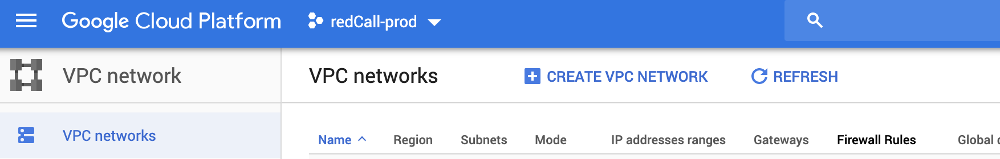
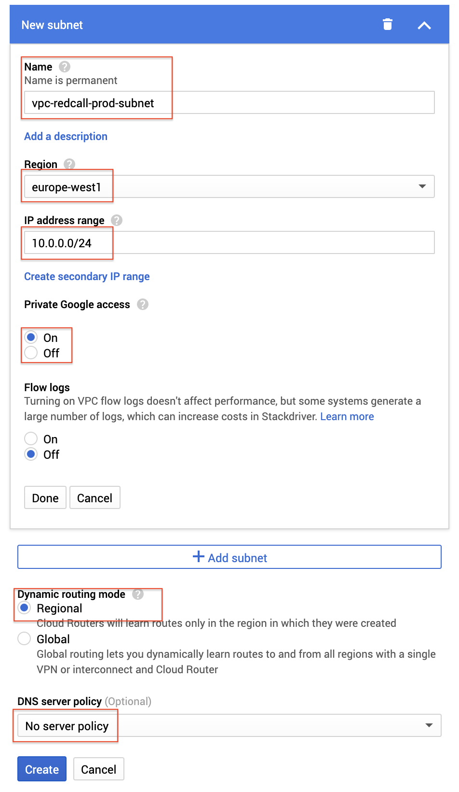
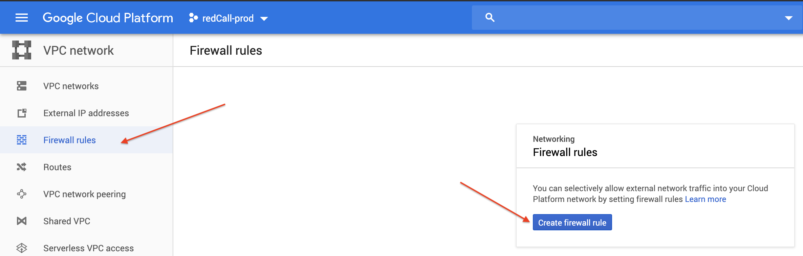
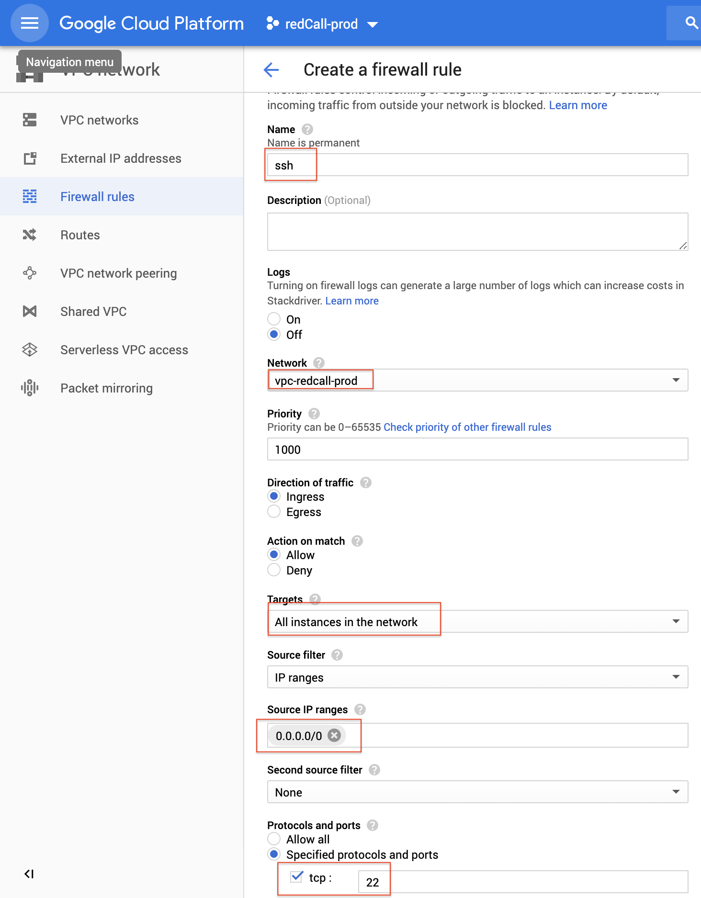
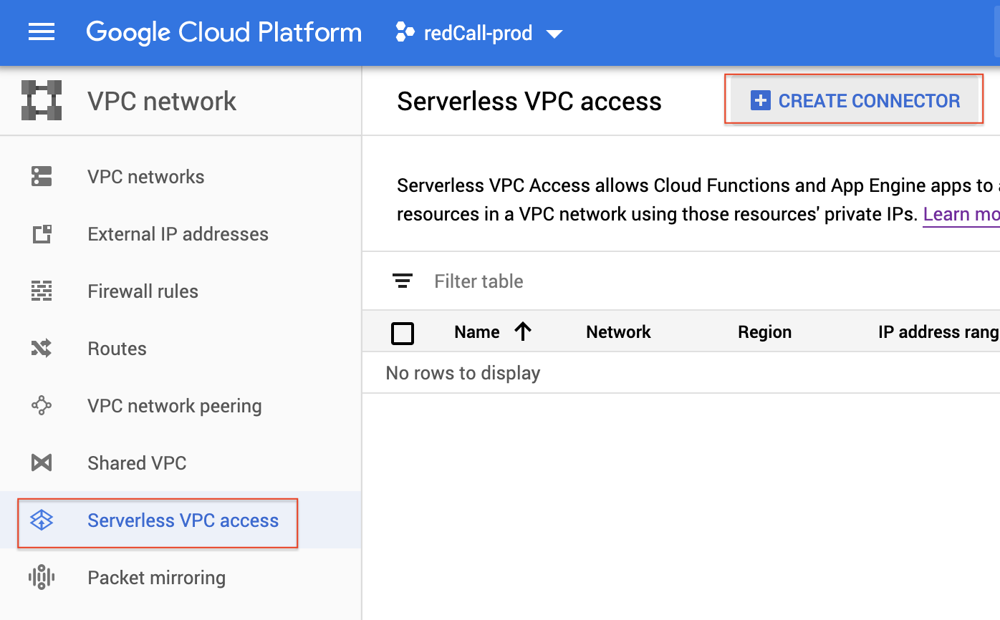
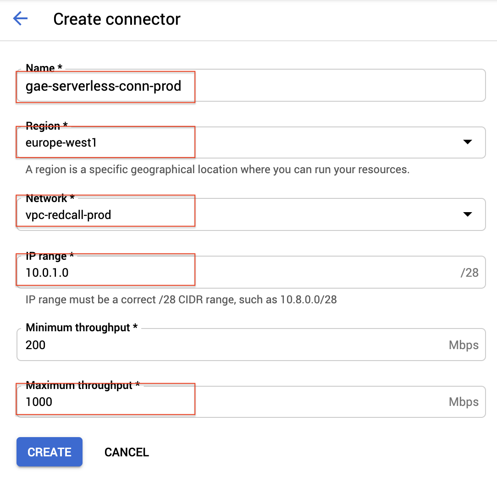

## Creating a Google Cloud SQL instance

**Objective**:
The project requires a MySQL-like database (MySQL, MariaDB...), and 
Google Cloud SQL is the GCP version of it.

By default, Cloud SQL instance are provided with a public ip address with no port open, which ease connectivity with cloud_sql_proxy.

However to increase security, we'll setup Cloud SQL instance with a private IP and explain how to connect to it from Google App Engine & your computer.

From Google App Engine, a serverless vpc access is required.

From your computer, it requires a Bastion. It's a tiny virtual machine in Compute Engine that will act as a proxy to reach the DB so that upgrade scripts can be executed from your computer.

See here : https://cloud.google.com/solutions/connecting-securely#bastion

The bastion virtual machine & the cloud sql instance will be setup on the same VPC network so that the bastion can connect to mysql. And gcloud compute ssh with port forwarding option will allow you to connect to mysql from your pc via the bastion.
The VPC access will allow GAE connectivity to MySQL

**Create A VPC network**:

1. Go to https://console.cloud.google.com and select your project.
2. Select "Create a VPC Network"

3. Set the VPC Network name as "vpc-redcall-ENV" where ENV is prod or dev and Fill the form as follow :

gcloud equivalent :

gcloud compute --project=redcall-prod-260921 networks create vpc-redcall-prod --subnet-mode=custom
gcloud compute --project=redcall-prod-260921 networks subnets create vpc-redcall-prod-subnet --network=vpc-redcall-prod --region=europe-west1 --range=10.0.0.0/24 --enable-private-ip-google-access

**Create A firewall rule to all SSH connection to allow connection to the bastion **:

1. Click on Firewal & Create Firewall rule

2. Name the rule "ssh" & fill the form as follow :

gcloud equivalent :
gcloud compute --project=redcall-prod-260921 firewall-rules create ssh --direction=INGRESS --priority=1000 --network=vpc-redcall-prod --action=ALLOW --rules=tcp:22 --source-ranges=0.0.0.0/0

**Create a Serverless VPC Access for Google App Engine**:

1. Click on Serverless VPC Access and then Create connector

2. Use the following name "gae-serverless-conn-ENV" where ENV is prod or dev and Fill the form as follow

