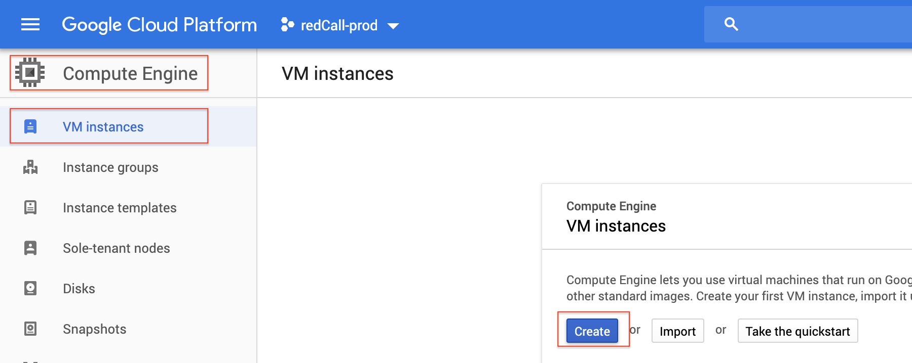
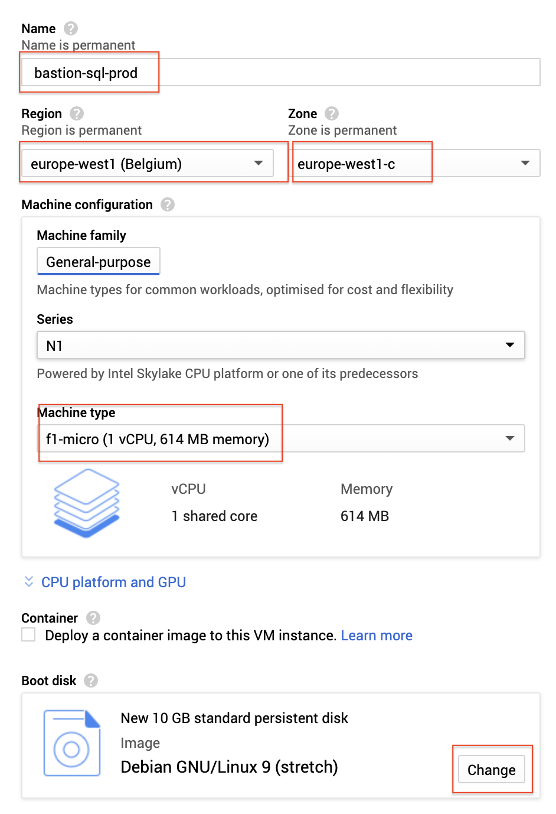
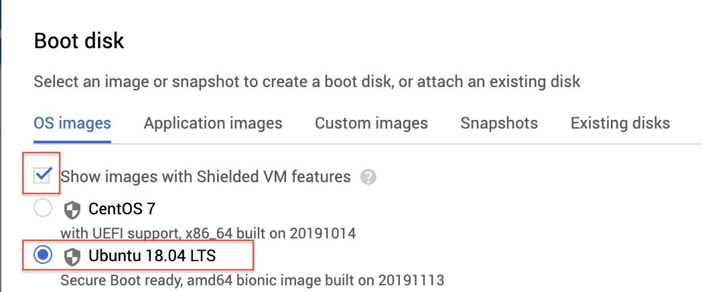
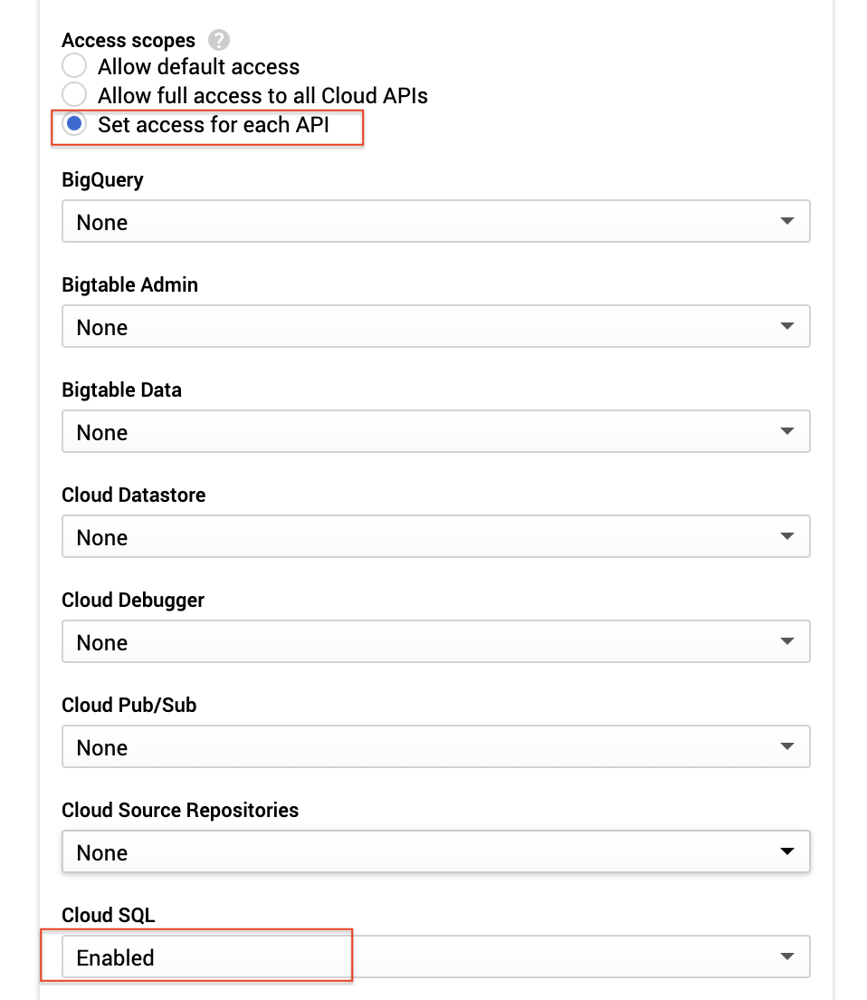
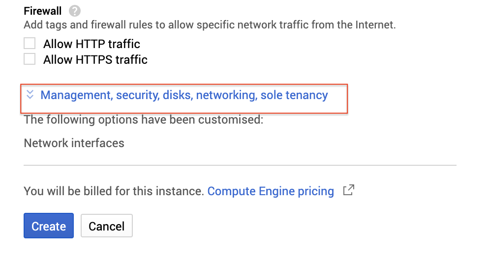
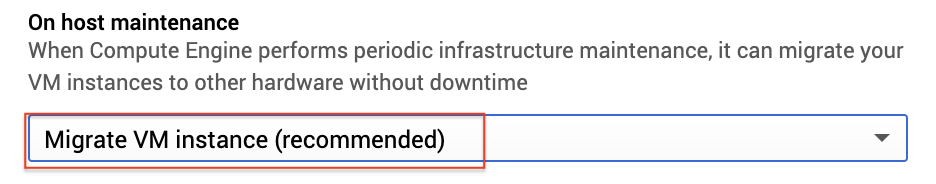
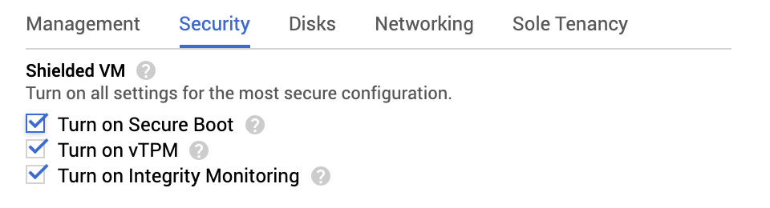
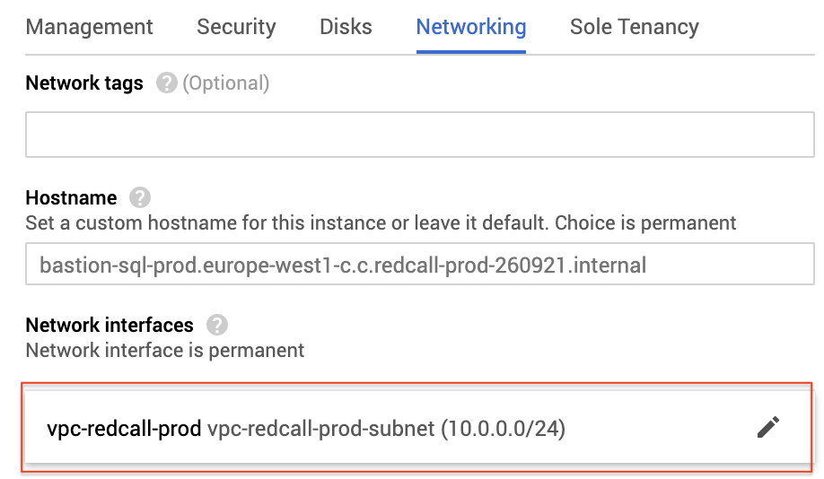
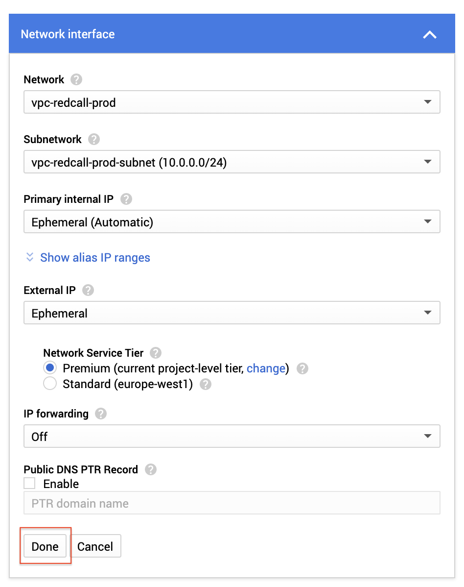

## Creating a Bastion

**Objective**:

a bastion is a compute engine instance that act as a bastion to access Cloud SQL from your laptop via "glcoud compute ssh" command
and enable a tunnel to connect to MySQL.

You can then use your scripts to update your schema or an IDE to query the schema using the tunnel.

**Create the Compute Engine**:

1. Go to Compute Engine -> VM Instance -> Create

2. Name the VM "bastion-sql-ENV" (ENV=prod or dev) change the region, zone & machine time as follow : 
an f1-micro instance should be enough for our purpose of ssh tunnelling. The machine power can be increased later if needed.

3. In the "boot disk" section click the "change" button to change the VM image
Check the "show images with shielded vm features" and then "Ubuntu 18.04" and click select.

4. In the "access scope" section

Select the "select access for each API" and then enable the cloud sql api

5. Click the "Management, Security, disk, networking, sole tenancy" link at the end of the page.

6. on the first tab (management), on the "on host maintenance" section, change the value to "migrate VM instance"

7. on the security tab, check "Turn on secure boot"

8. on the network tab, click the network and ensure you select the VPC network created in step 01.b

check that the values are as follow:

**Command line equivalent:**

gcloud beta compute --project=redcall-prod-260921 instances create bastion-sql-prod --zone=europe-west1-c --machine-type=f1-micro --subnet=vpc-redcall-prod-subnet --network-tier=PREMIUM --no-restart-on-failure --maintenance-policy=MIGRATE --service-account=464252986963-compute@developer.gserviceaccount.com --scopes=https://www.googleapis.com/auth/sqlservice.admin,https://www.googleapis.com/auth/servicecontrol,https://www.googleapis.com/auth/service.management.readonly,https://www.googleapis.com/auth/logging.write,https://www.googleapis.com/auth/monitoring.write,https://www.googleapis.com/auth/trace.append,https://www.googleapis.com/auth/devstorage.read_only --image=ubuntu-1804-bionic-v20191113 --image-project=gce-uefi-images --boot-disk-size=10GB --boot-disk-type=pd-standard --boot-disk-device-name=bastion-sql-prod --shielded-secure-boot --shielded-vtpm --shielded-integrity-monitoring --reservation-affinity=any
