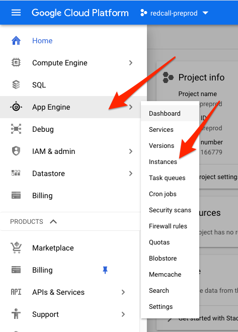
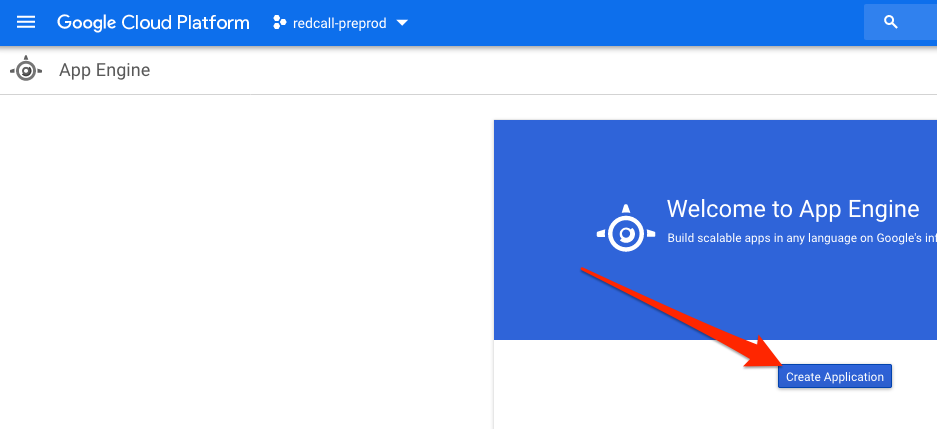
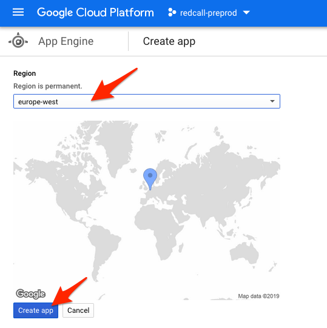
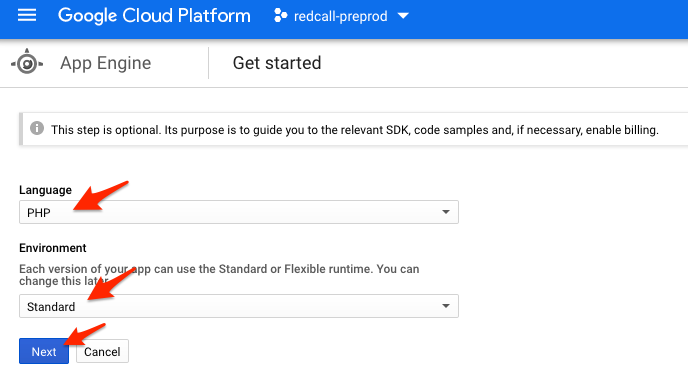
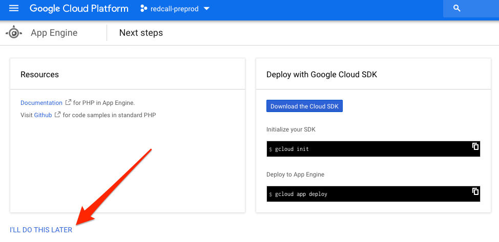

## Creating a new Google App Engine instance

**Objective**: Set-up a basic Google App Engine instance. You will need to
tweak performances by yourself if you are setting up a production environment.

1. Go to https://console.cloud.google.com and select your project.

2. In the upper-left menu, select "App Engine" then "Instances".
<br/>

3. Click "Create application"
<br/>

4. Select your region and click "Create app".
<br/>

5. Select "PHP" as language, and "Standard" as environment.
<br/>

6. Click "I'll do this later".
<br/>

7. Make sure you have `gcloud` command installed.
If you haven't, check https://cloud.google.com/sdk/install

8. Set-up gcloud with your project:

```bash
mkdir -p /tmp/gae
cd /tmp/gae
echo 'runtime: php72' > app.yaml
echo 'Hello, world!' > index.php
```

Switch `gcloud` to the right Google Account:

```bash
gcloud login
```

Switch `gcloud` to the right project of that Google Account:

```bash
gcloud config set project redcall-preprod
```

Initialize the configuration for this project (if `gcloud` tells that
you already use a default configuration, just ^C):

```bash
gcloud init
```

Deploy the project:

```
gcloud app deploy
```

9. You can now get to https://redcall-preprod.appspot.com/ and check that your
application is working.

[Go back](../../README.md)
