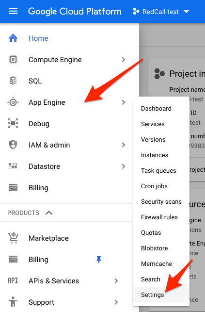
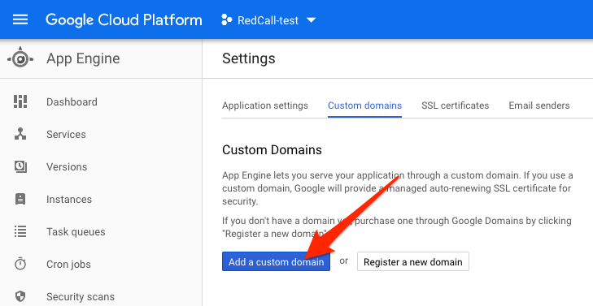
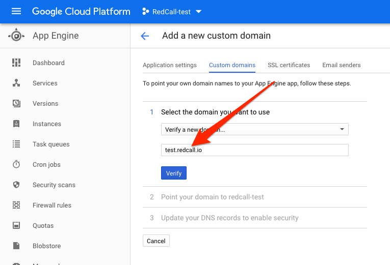
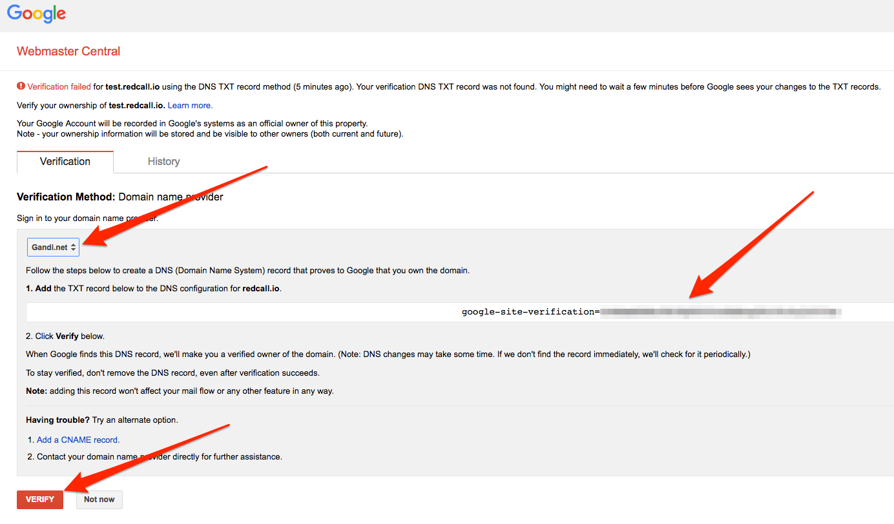
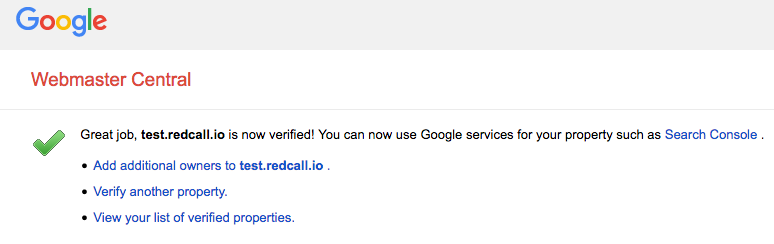
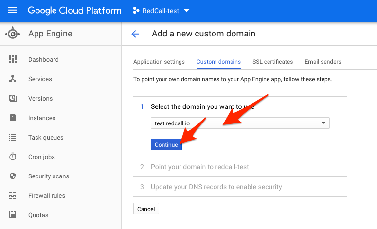
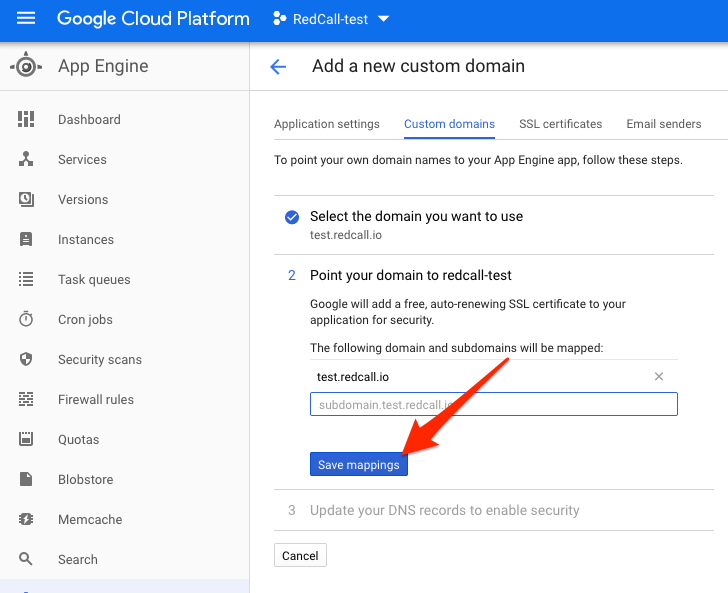

## Creating a new Google App Engine instance

**Objective**: Use your own domain name instead of the default appspot.com's one.

Note that in this sample, screenshots show "test.redcall.io" while
everywhere else we are using "preprod.redcall.io". It's because I'd already
registered "preprod.redcall.io" and needed to create a new one for screenshots.

1. Go to https://console.cloud.google.com and select your project.

2. In the upper-left menu, select "App Engine" then "Settings".
<br/>

3. Click on "Custom Domains"
<br/>

4. Click on "Add a custom domain"
<br/>

5. Enter your domain name and click "Verify"
<br/>

6. In the new tab, select your registrar in the menu and follow the instructions
<br/>

7. Once done, close the tab.
<br/>

8. Refresh the previous page and select the domain you just created. Click Continue.
<br/>

9. Confirm certificate creation for the domains you need and click "Save Mappings" then "Continue".
<br/>

10. Configure the given DNS on your registrar.

```
preprod 1800 IN A 216.239.32.21
preprod 1800 IN A 216.239.34.21
preprod 1800 IN A 216.239.36.21
preprod 1800 IN A 216.239.38.21
preprod 1800 IN AAAA 2001:4860:4802:32::15
preprod 1800 IN AAAA 2001:4860:4802:34::15
preprod 1800 IN AAAA 2001:4860:4802:36::15
preprod 1800 IN AAAA 2001:4860:4802:38::15
```

11. Click "Done" on GCP interface.

Wait for a few minutes that your DNS spreads and that your certificate is
ready, and then check that your domain is working properly by going to
http://preprod.redcall.io

[Go back](../../README.md)
