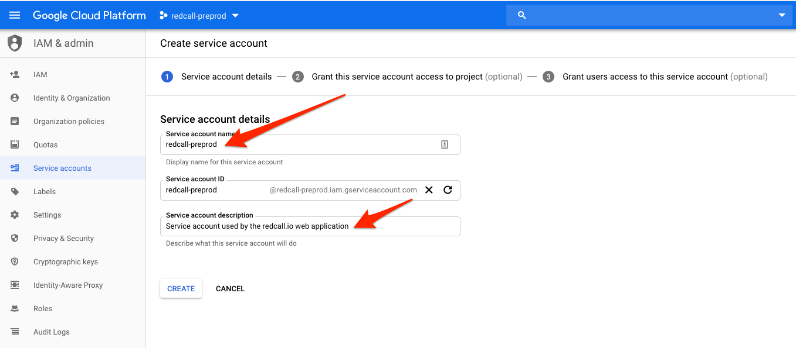
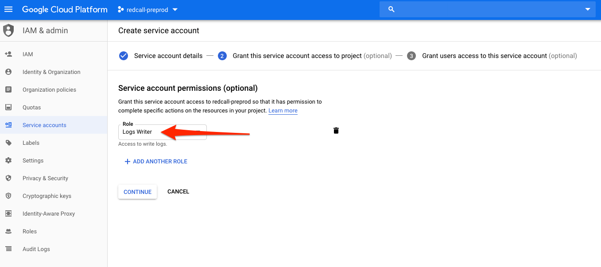
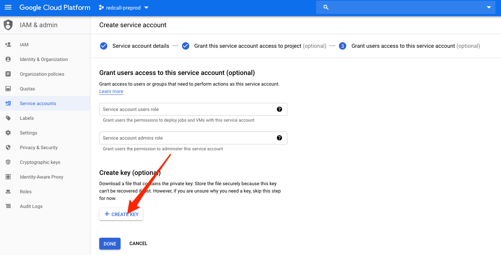
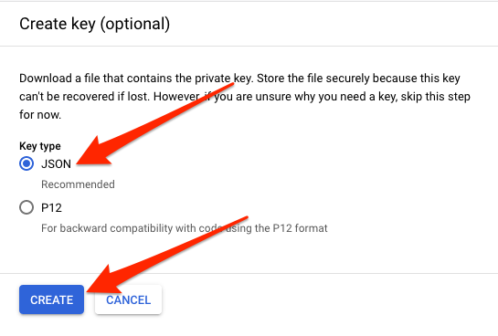
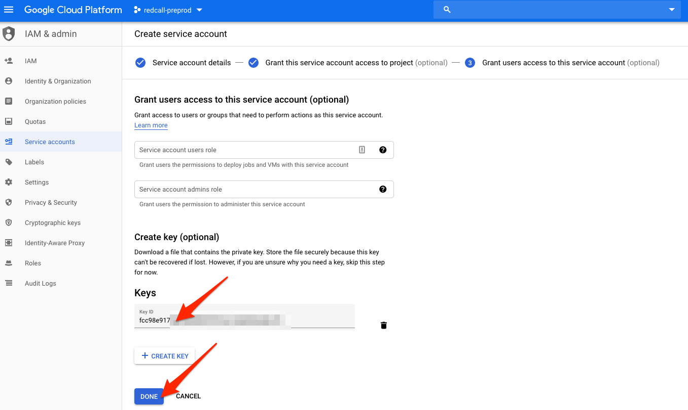

## Creating Google Service Account

**Objective**: Generate the credentials used by the application to access
google APIs, such as stackdriver. 

1. Go to https://console.cloud.google.com and select your project.

2. In the upper-left menu, select "IAM & Admin" then "Service Accounts".
 

3. Click "Create Service Account"
 

4. Fill up the form with precise descriptions
 

5. In the roles section, select "Logs Writer"
 

6. In the Keys section, click "Create Key"
 

7. Select "JSON" format and click "Create"
 

8. Download the JSON file, and copy its content into `deploy/preprod/google-service-account.json`

9. Once your key is ready, click "Done"
 

### Project configuration

- In your `dotenv`, leave `GOOGLE_API_KEY`, `GOOGLE_CLIENT_ID` and `GOOGLE_CLIENT_SECRET` blank

- Rename your JSON file to google-service-account.json and move it in [preprod](../deploy/preprod) or [prod](../deploy/prod) directories.

[Go back](../../README.md)
