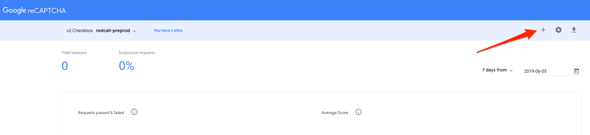
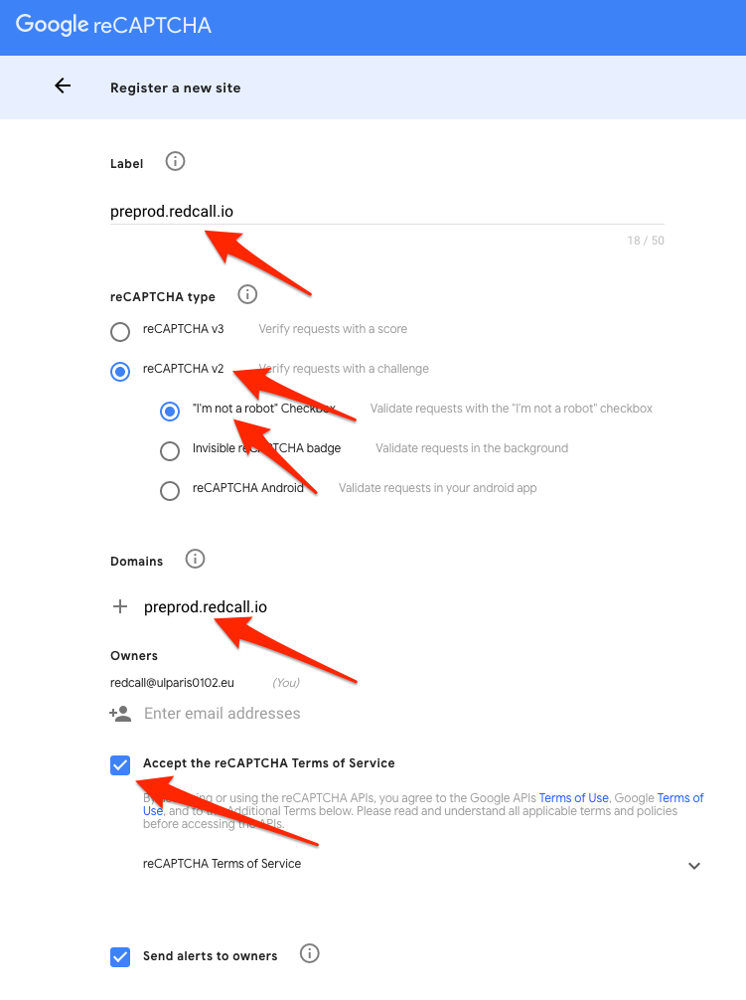
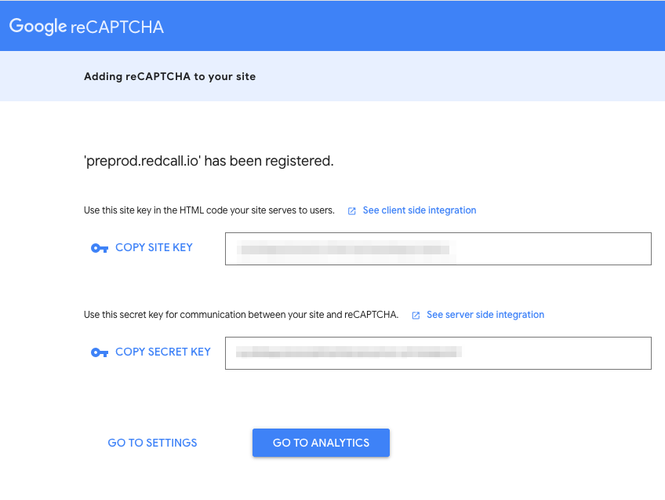

## Creating Google Recaptcha credentails

Directories [prod](../../deploy/prod) and [preprod](../../deploy/preprod) 
contain a `dotenv` file that you need to fill up with the right configuration.

**Objective**:
Goal is to secure all authentication-related form using a captcha after a
certain amount of failures, to protect the website against bruteforce-aware
attacks (credentials stuffing, dictionary attacks, user enumerations...).

1. You should go to: [https://www.google.com/recaptcha/admin#list](https://www.google.com/recaptcha/admin#list).

2. Click "+" button
 
 
3. You should create a "reCAPTCHA v2" of the kind "I am not a robot". You
cannot set another type because current implementation won't support it. Then,
fill up the form and click "Create".
 

4. That's the credentials rendered in the next page that will be used in
the project configuration.
 

### Project configuration

- `GOOGLE_RECAPTCHA_SITE_KEY` should contain your recaptcha key
 
- `GOOGLE_RECAPTCHA_SECRET` should contain your recaptcha secret

[Go back](../../README.md)
