## Creating a Google Cloud SQL instance

Directories [prod](../../deploy/prod) and [preprod](../../deploy/preprod) 
contain a `dotenv` file that you need to fill up with the right configuration.

**Objective**:
The project requires a MySQL-like database (MySQL, MariaDB...), and 
Google Cloud SQL is the GCP version of it.

1. Go to https://console.cloud.google.com and select your project.

2. In the upper-left menu, select "SQL".
<br/>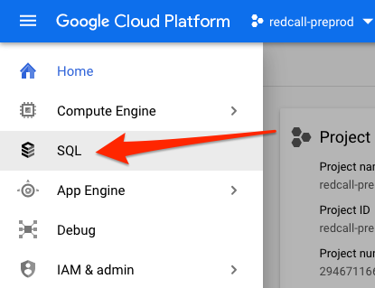

3. Click "Create instance"
<br/>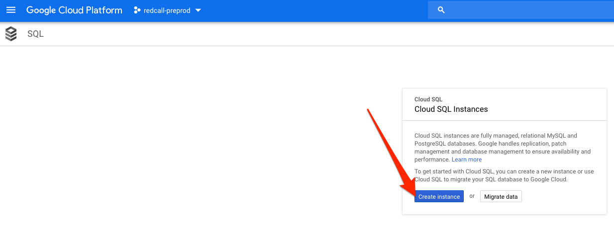

4. Choose "MySQL"
<br/>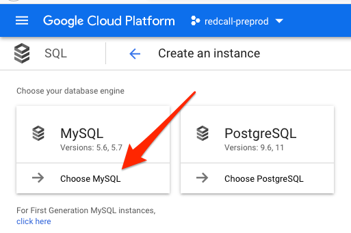

5. Fill up the form as follow
Copy the password and put it in a keepass storage
Change the zone to west1c
and click the "Show configuration option" link
<br/>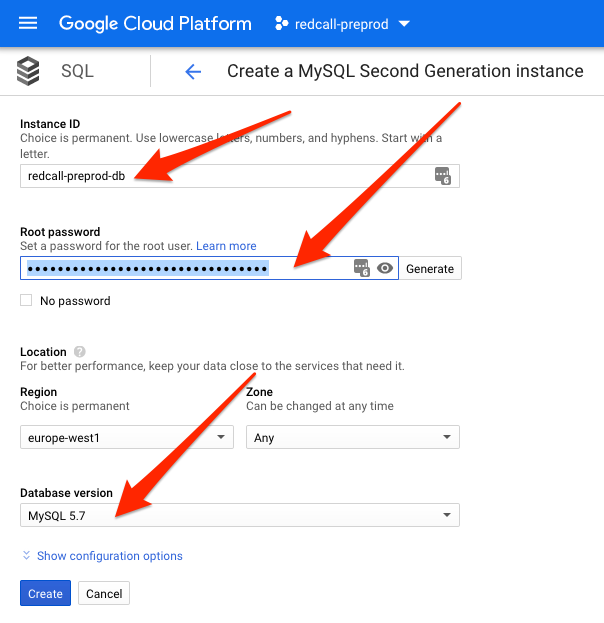

5. Additionnal configuration
    - Click the connectivity button
Uncheck the "public ip" and check the "private ip" and be sure to choose the VPC network created in step 1.b
then click the "allocate and connect" blue button.
While it's connecting, you can continue the configuration.
<br/>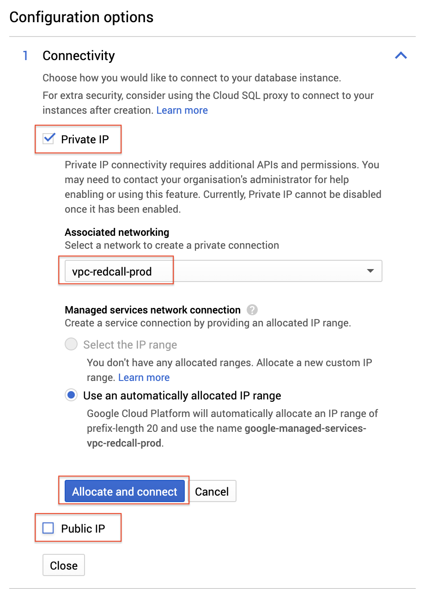

    - Click the "Machine type and storage"
click change
<br/>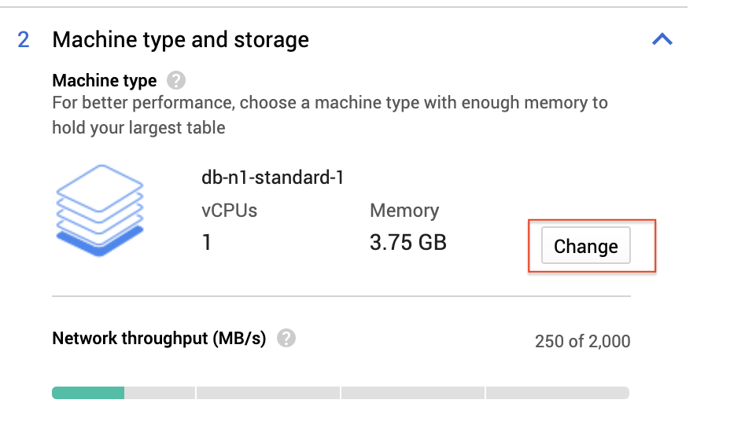
and select the machine "db-n1-standard-2"
<br/>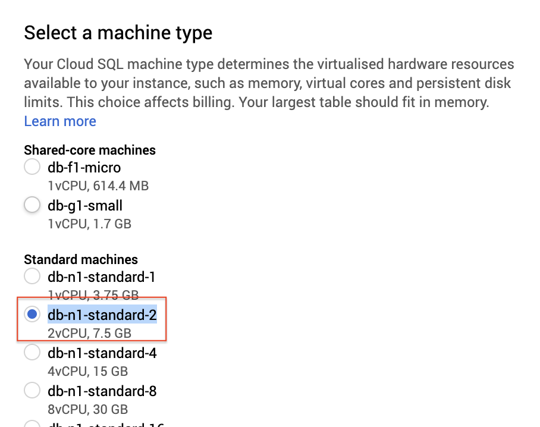

    - Click the "Auto backups and high availability"
and change the backup window to "03:00 to 07:00"
<br/>

    - Click the "Maintenance"
Choose Monday, 02:00 - 03:00, Earlier
<br/>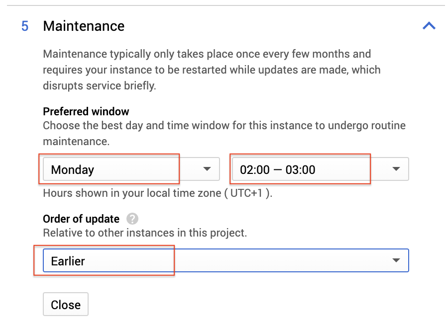

6. Wait that your instance pops up (it may take a while), then click on it.
<br/>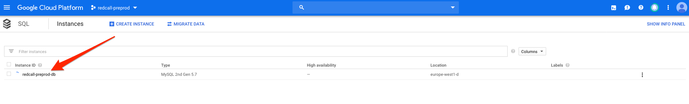

7. Click on "Connections" tab 
<br/>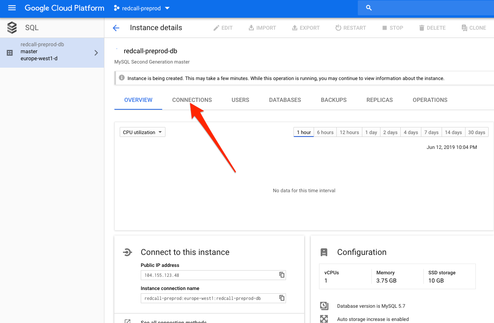

8. Click "Add network" under the "Public IP" connectivity
<br/>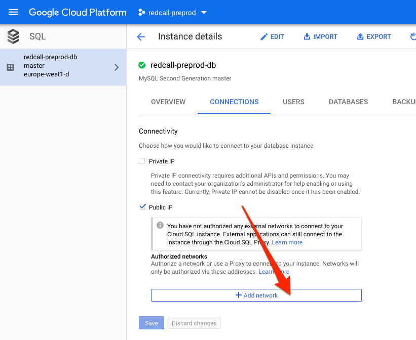

9. Add temporarly [your personal IP address](https://www.google.com/search?q=my+ip) and click Done
<br/>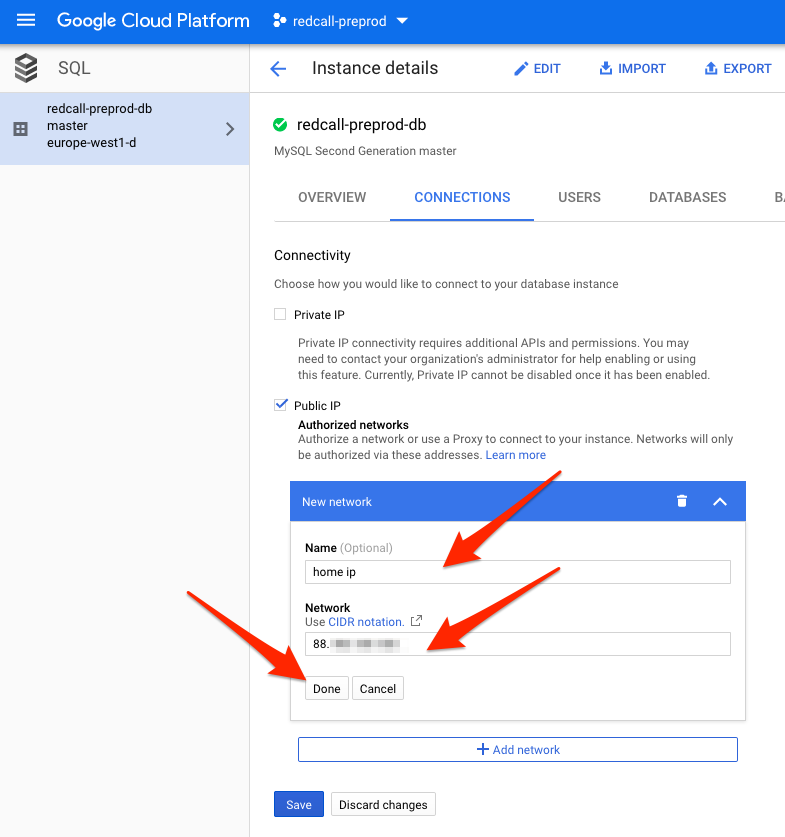

10. Click "Save"
<br/>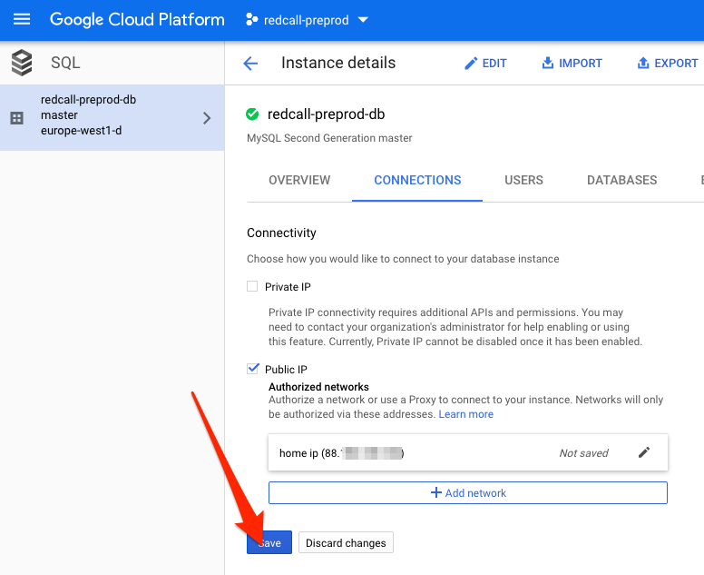

11. Click on "Overview" tab
<br/>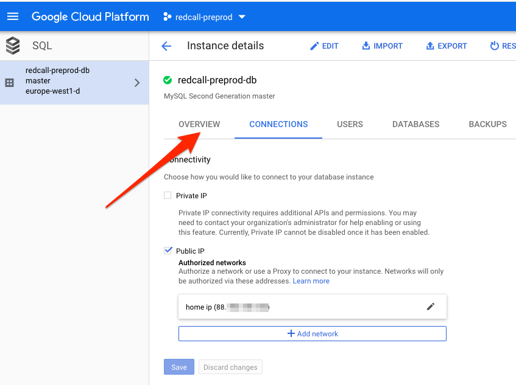

12. Copy the public IP of your Cloud SQL instance
<br/>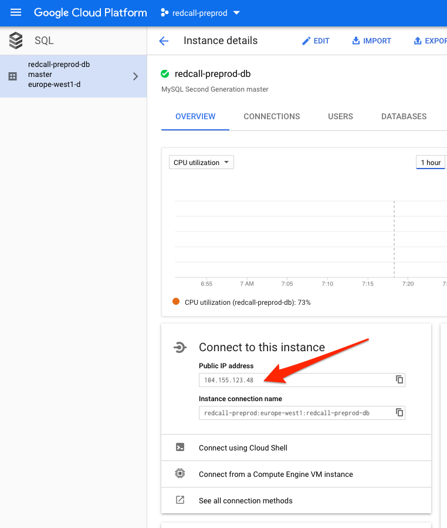

13. Connect to your database and enter the root password you chosen earlier

```
mysql -h 104.155.123.48 -u root -p
```

14. Create the database and its account (note that "localhost" here will
grant the access to a unix socket, which will be correct on Google App Engine).

```sql
CREATE DATABASE redcall_preprod;
GRANT ALL PRIVILEGES ON redcall_preprod.* 
                     TO 'redcall_preprod'@'%'
                     IDENTIFIED BY 'some password';
```

15. Run the [development environment](00-development.md) in order to generate the database schema

16. In the `.env` file of the [symfony](../../symfony/) directory, change `DATABASE_URL` environment variable to point to your Cloud SQL db:

```
DATABASE_URL=mysql://root:<your root password>@104.155.123.48:3306/redcall_preprod
```

17. Inside the container, run the following command:

```
php bin/console doctrine:migration:migrate
```

18. Remove your home public IP address from the SQL instance.
<br/>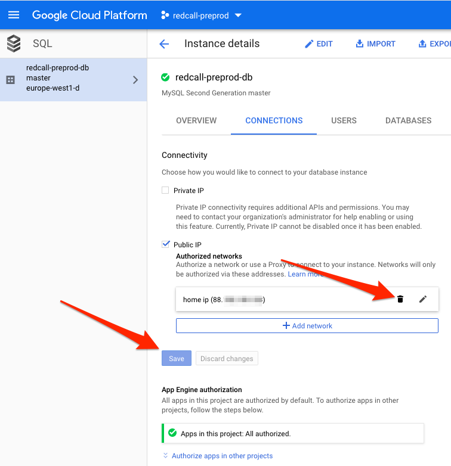

19. In the upper-left menu, select "Marketplace".
<br/>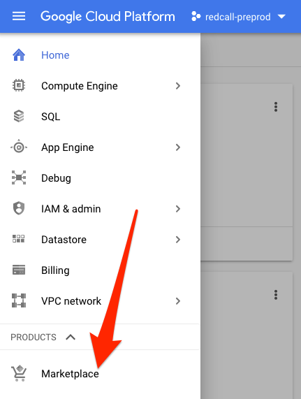

20. Search for "Cloud SQL Admin"
<br/>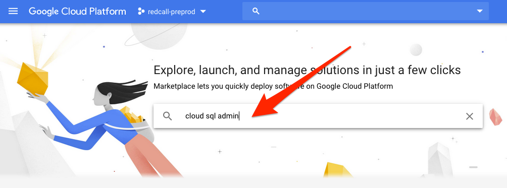

21. Click on "Cloud SQL Admin"
<br/>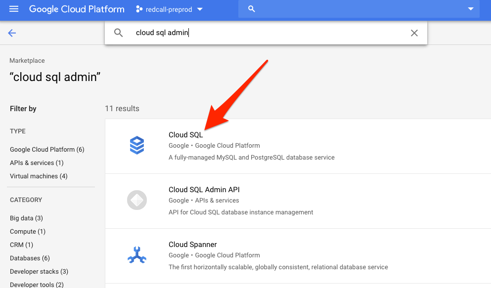

22. Click "Enable"
<br/>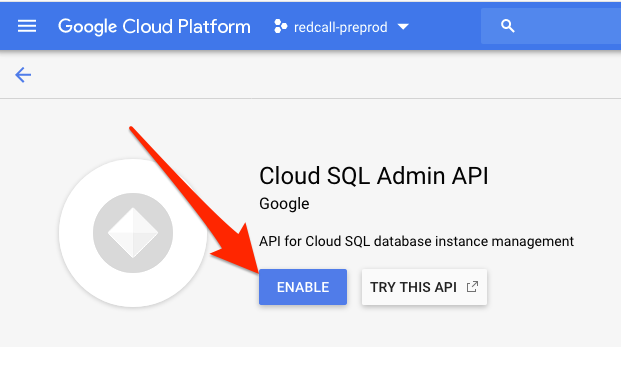

You're now ready.

### Project upgrade

Note that if you pull the project after a long time, you may need to run
this command again in order to upgrade your database schema.

### Project configuration

In your `dotenv` file of the [deploy](../../deploy) directory of your choice,
you should set the unix socket of your Cloud SQL instance:

```
DATABASE_URL=mysql://redcall_preprod:<your non-root user's password>@localhost/redcall_preprod?unix_socket=/cloudsql/<instance connection name>
```

Note that "instance connection name" can be found just below the public IP of your instance:
<br/>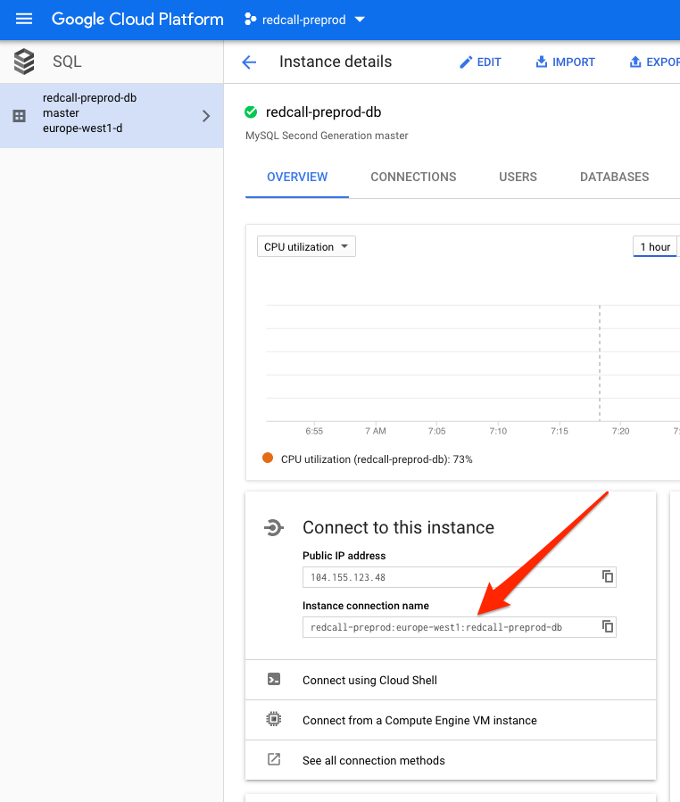

It is `redcall-preprod:europe-west1:redcall-preprod-db` in that case, so the environment variable would look like:

```
DATABASE_URL=mysql://redcall_preprod:<your non-root user's password>@localhost/redcall_preprod?unix_socket=/cloudsql/redcall-preprod:europe-west1:redcall-preprod-db
```

[Go back](../../README.md)
