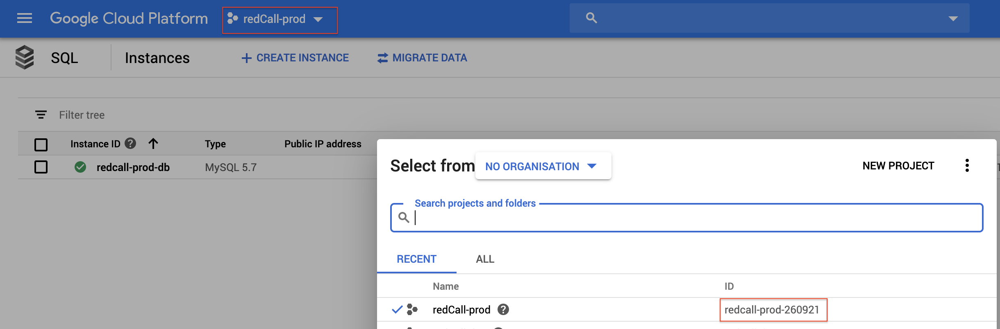
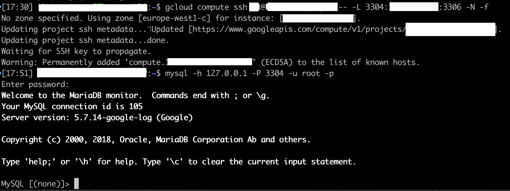

## Connect to the MySQL instance from your laptop

**Objective**
Be able to connect to MySQL from your PC to apply schema changes when deploying a new version or using an IDE to query the data.

1. set project

`gcloud config set project redcall-prod-260921`

You can get the project ID, by click the current project in the Cloud Console and copy the second column value:

 

2. create an ssh connection to the bastion and enable a tunnel for mysql connection

`gcloud compute ssh USERNAME@BASTION_NAME -- -L FREE_LOCAL_PORT:PRIVATE_MYSQL_IP:3306 -N -f`

where :

   - USERNAME : it's the left part of your email address that you use with gcloud
   - BASTION_NAME: the name of the bastion. You can get it in "Compute Engine", "VM Instance"
   - FREE_LOCAL_PORT : choose a free port on your PC, like 3304
   - PRIVATE_MYSQL_IP : the private ip address, you can get it from the "Cloud SQL" summary window

-N Only create the tunnel and do not spawn a shell on the bastion

-f run ssh in the background.

example : 
`gcloud compute ssh robert@sql-bast-prd -- -L 3304:10.20.40.34:3306 -N -f`

3. Connect to MySQL

mysql -h 127.0.0.1 -P 3304 -u root -p

the password is setup is step 07.

 
