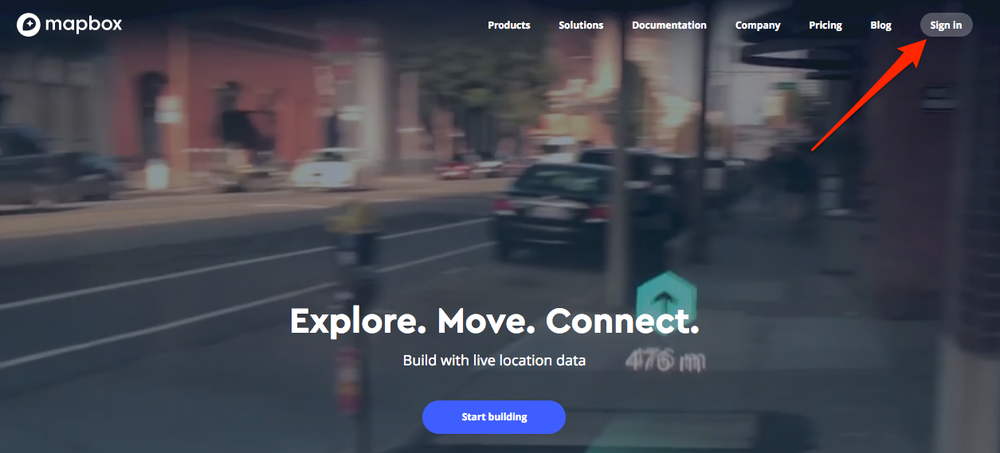
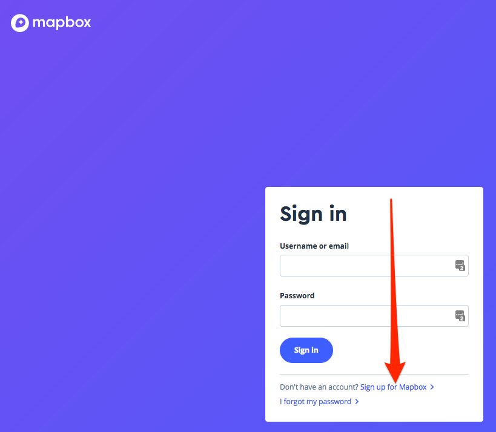
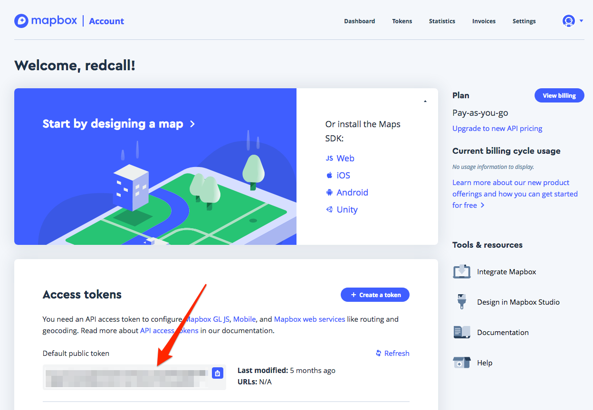

## Creating MapBox key

Directories [prod](../../deploy/prod) and [preprod](../../deploy/preprod) 
contain a `dotenv` file that you need to fill up with the right configuration.

**Objective**:
Once called, volunteers are able to geolocate their teammates. For this, we
are using OpenStreetMap database with MapBox SDK and API. We thus need to
set-up a MapBox api key.

1. Go to https://www.mapbox.com and click "Sign-in"
 

2. Click on "Sign up for MapBox"
 

3. After signing up, you will directly see your "default public token"
   at the bottom
 

### Project configuration

Once done, you will put the key in `MAPBOX_API_KEY` environment variable.

[Go back](../../README.md)

