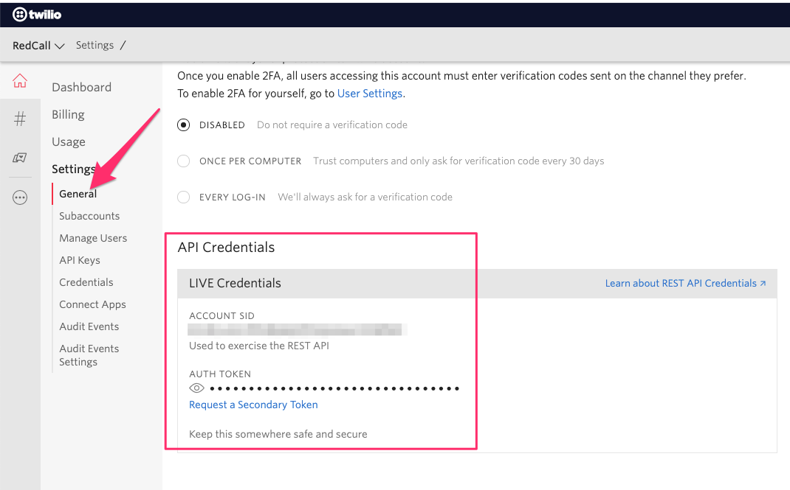

# Twilio

Twilio is the SMS provider: http://twilio.com/

Once you created your account:

1) You need to get your API credentials, you'll find them at https://www.twilio.com/console/project/settings

2) You need to reserve one phone number which will send and receive messages. 

- Go to https://www.twilio.com/console/phone-numbers/incoming

- Create a phone number (or two if you have a staging environment)

- Share it with your volunteers so they'll know you will trigger them through it

3) If you wish to accelerate the number of voice calls sent per second, you need to ask your account manager for more "Twilio Voice API CPS". By default, RedCall send 5 calls per second.

### Project configuration

- Set `TWILIO_ACCOUNT_SID` with your Twilio account SID

- Set `TWILIO_AUTH_TOKEN` with your api token

- Set `TWILIO_NUMBER` with your phone number(s), without leading "+", and separated by a comma.

[Go back](../../README.md)
