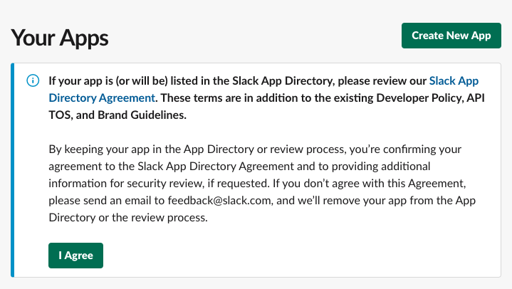
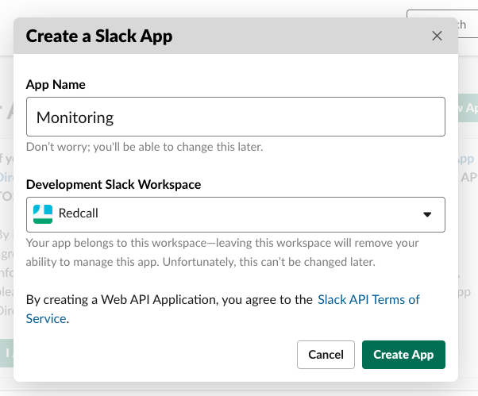
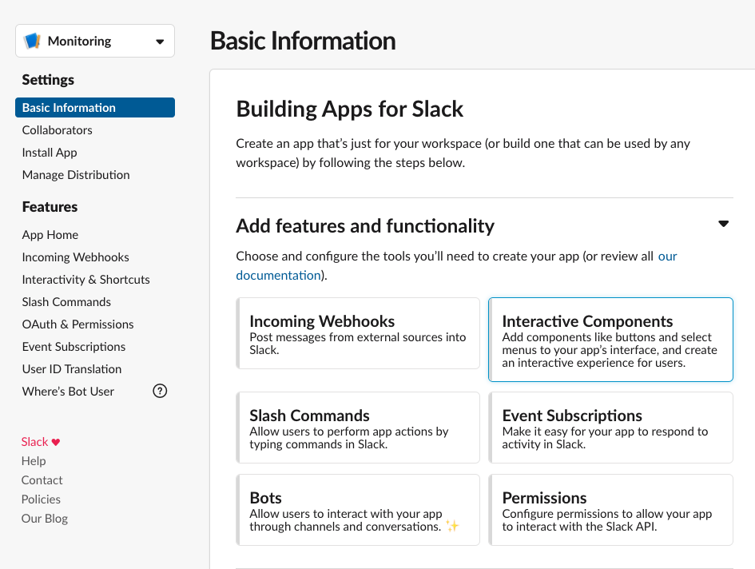
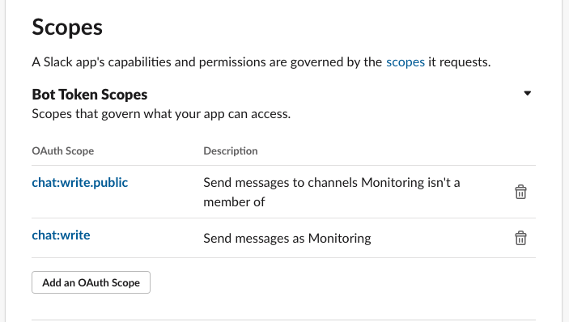
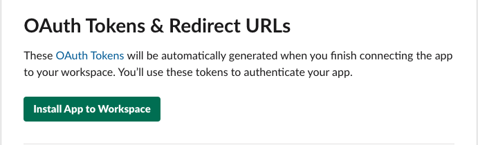
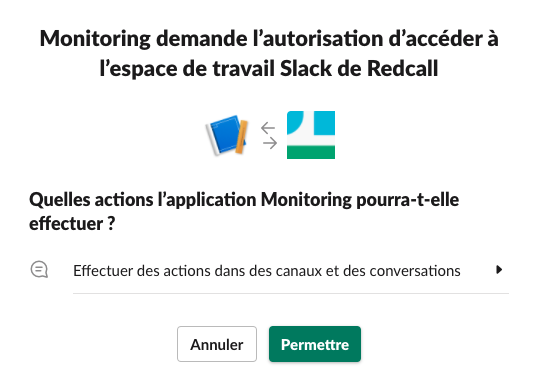
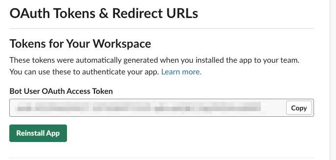

# Slack

If you wish to get error notifications on slack, you should set it up.

1) go to https://api.slack.com/apps and click "Create new app"

2) enter a name and choose your workspace

3) click on "oauth & permissions" on left menu

4) add "chat.write.public" and "chat.write" scopes 

5) click "install app" 

6) grant permissions

7) you now have your slack token 

### Project configuration

- Set `SLACK_TOKEN` with your Slack token

- Set `SLACK_CHANNEL` you wish to use to receive errors

- Set `SLACK_EMOJI` with any icon you want (to distinguish environments for example)

[Go back](../../README.md)
