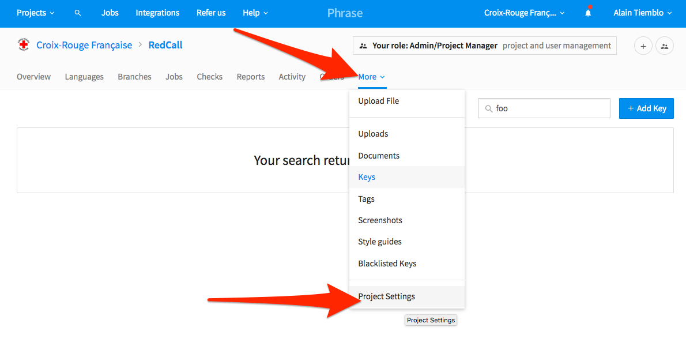
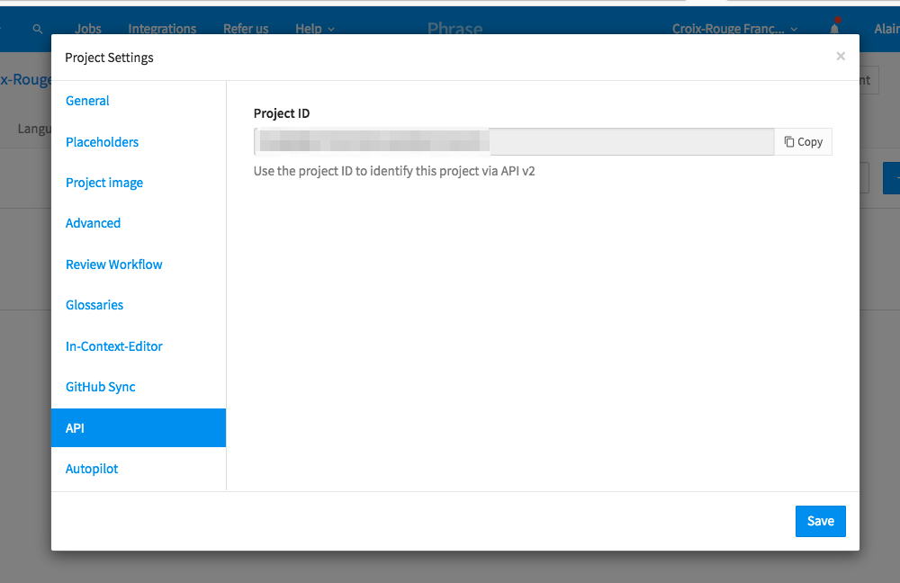
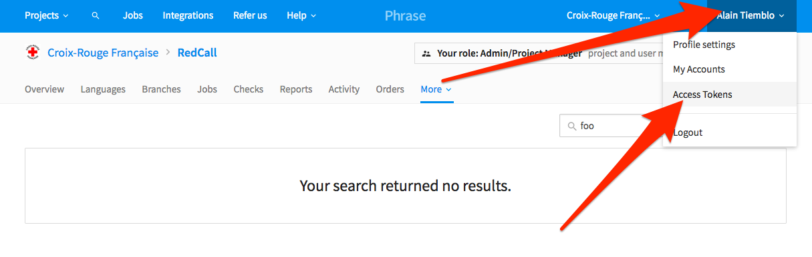

# Phrase

We are using Phrase to ease translation management, in order to let people from all over the world
translate the application.

1. Create an account at https://phrase.com

2. Once done, you need your project ID ; go to "More" and select "Project Settings"

<br/>

3. From here, click on "API" tab, and save your Project ID

<br/>

4. Now, you need an access token: click on your account's drop down menu, and click "Access Tokens" 

<br/>

5. Generate a token and fill up the configuration (see at the bottom)

6. You can now create all translation keys on Phrase by running:

```
php bin/console phrase:sync --sleep=10
```

Be careful, the Yaml parser on Phrase backends is compatible with YAML 1.1, there are few reserved words
(like "Yes" and "No" we often show on modals to ask questions to our users) that you should not use as
translation keys or translation key segment. 

### Project configuration

Set the following keys according to what you gathered above:

- `PHRASEAPP_PROJECT_ID`
- `PHRASEAPP_API_TOKEN`
- `PHRASEAPP_USER_AGENT`

[Go back](../../README.md)
