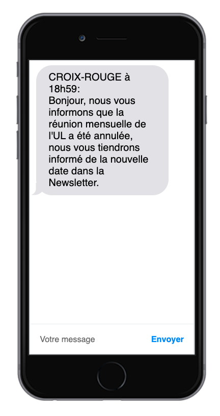
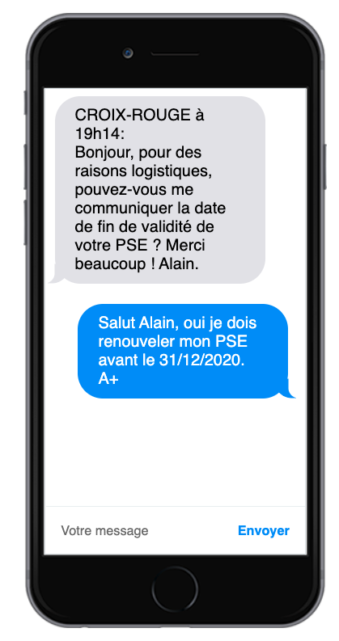
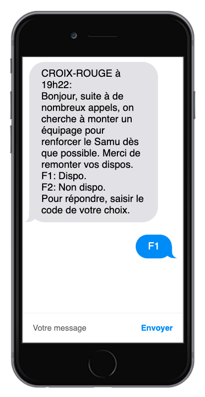
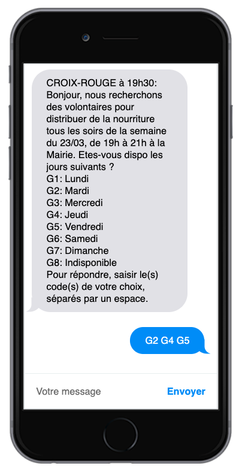
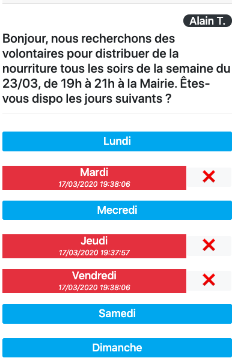

# RedCall pour les volontaires

## Présentation

RedCall permet aux responsables de l'urgence de recenser les bénévoles de leur(s) unité(s) locale(s) en fonction de leurs compétences. 
Ils peuvent poser une question qui est envoyée par SMS ou par email aux volontaires, et les réponses renvoyées par ces derniers sont affichées en temps réel sur un tableau de bord.

[Comprendre RedCall en moins de 3 minutes](https://www.youtube.com/watch?v=0g8YDprUqg8)

En tant que bénévole, vous pouvez être appelé par votre unité locale à rejoindre des équipages ou/et interventions en fonction de vos intérêts et de vos compétences.

Renseignez-vous auprès de votre unité locale afin de connaître les formations possibles dans l'Action Sociale et l'Urgence Secours.

## Moyens de communication

Les SMS vous sont envoyés lorsqu'une information importante doit vous être transmise, ou lorsqu'un événement nécessite un équipage en particulier. Soyez si possible réactifs lorsque vous les recevez, afin d'aider au mieux votre UL à gérer un possible incident. Vous pouvez également recevoir des emails, pour d'autres communications moins urgentes.

#### Vérifiez vos coordonnées sur Gaia

Afin de recevoir tous les messages, assurez-vous que votre informations de téléphone mobile et d'email personnel soient corrects sur Gaia.

Vérifiez également que vos formations & compétences soient bien renseignées (secouriste PSE, chauffeur VL, etc)

Rendez-vous sur https://gaia.croix-rouge.fr

## Messages informatif

Lorsque votre unité locale a une information à vous transmettre, aucune intervention de votre part n'est requise.

## Question ouverte

Lorsque votre unité locale a une question à vous poser, vous pouvez y répondre naturellement. Votre réponse apparaîtra automatiquement sur le tableau de bord de votre interlocuteur.

## Question à réponse simple

Lorsque votre unité locale a besoin de monter un équipage, elle va d'abord envoyer un message à tout le monde afin de recenser vos disponibilités. 

Lorsqu'une seule réponse est possible, on vous demandera de répondre par le code de la réponse, dans l'exemple ci-dessous soit F1, soit F2. Votre réponse peut ne pas être prise en compte si vous répondez directement "Dispo." ou "1" car elle nécessite un traitement manuel qui dans l'urgence peut être oublié.

## Question à réponses multiples

De temps en temps, la question posée vous proposera de choisir plusieurs réponses. Dans ce cas, envoyez les codes de votre réponse en les séparant par un espace.

## Question par email

Lorsqu'une question vous est posée par email (que ce soit à choix multiple ou non), vous recevez un lien qui permet d'y répondre.

Cliquez simplement sur les réponses qui vous conviennent.

